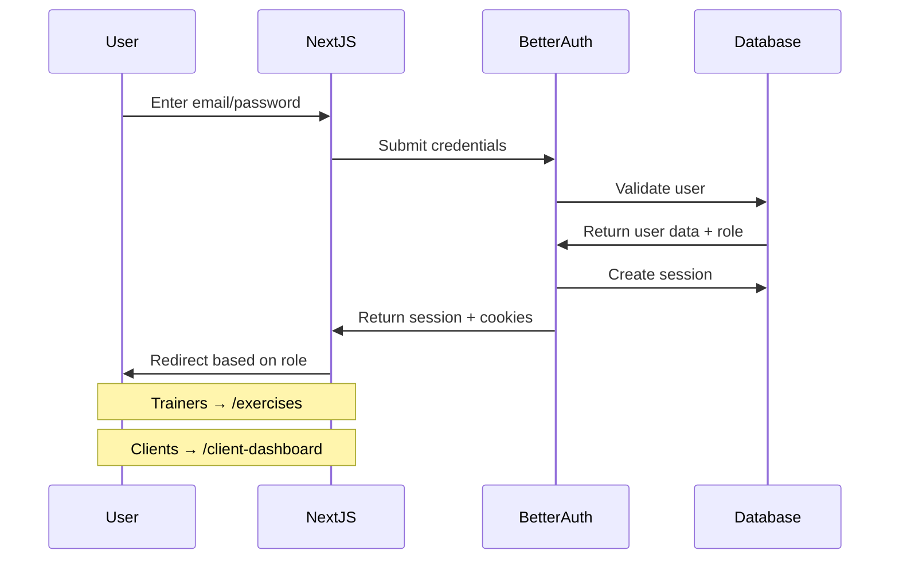
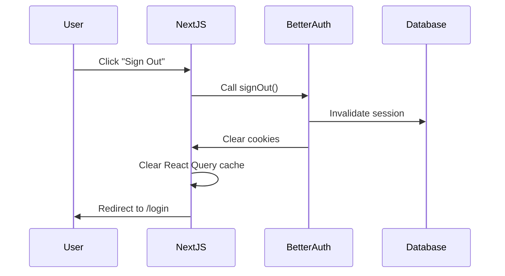

# Fitness App - Technical Reference

## Project Overview

This is a **full-stack fitness application** built on the **create-t3-turbo** stack, featuring a monorepo architecture with web and mobile applications. The project uses TypeScript throughout for end-to-end type safety.

**Current State**: The app is currently a basic blog/post system with authentication. It provides a solid foundation for building fitness-specific features.

## Technology Stack

| Technology | Version | Purpose |
|------------|---------|---------|
| **Next.js** | 15.1.3 | Web application framework |
| **React** | 19.0.0 | UI library |
| **Expo** | SDK 53 | Mobile development platform |
| **React Native** | 0.76.6 | Mobile UI framework |
| **tRPC** | 11.0.12 | Type-safe API layer |
| **Better Auth** | 1.2.2 | Authentication solution |
| **Drizzle ORM** | 0.44.1 | Database ORM |
| **PostgreSQL** | - | Database (via Supabase) |
| **Tailwind CSS** | 3.4.17 | Styling framework |
| **TypeScript** | 5.7.2 | Type safety |
| **Turborepo** | 2.3.3 | Monorepo build system |
| **pnpm** | 10.11.1 | Package manager |

## Project Structure

```
fitness_app/
├── apps/
│   ├── expo/                    # React Native mobile app
│   │   ├── src/
│   │   │   ├── app/            # Expo Router pages
│   │   │   ├── components/     # Mobile-specific components
│   │   │   └── utils/          # Mobile utilities (auth, api)
│   │   ├── app.json           # Expo configuration
│   │   └── package.json
│   └── nextjs/                 # Next.js web application
│       ├── src/
│       │   ├── app/           # App Router pages
│       │   ├── auth/          # Authentication setup
│       │   ├── components/    # Web components
│       │   └── trpc/          # tRPC client setup
│       ├── next.config.js
│       └── package.json
├── packages/
│   ├── api/                   # tRPC API definitions
│   │   ├── src/
│   │   │   ├── router/       # API route handlers
│   │   │   ├── root.ts       # Main tRPC router
│   │   │   └── trpc.ts       # tRPC configuration
│   │   └── package.json
│   ├── auth/                  # Authentication logic
│   │   ├── src/
│   │   │   └── index.ts      # Better Auth configuration
│   │   └── package.json
│   ├── db/                    # Database layer
│   │   ├── src/
│   │   │   ├── schema.ts     # Drizzle schema definitions
│   │   │   ├── client.ts     # Database client
│   │   │   └── index.ts      # Exports
│   │   ├── drizzle.config.ts # Drizzle configuration
│   │   └── package.json
│   ├── ui/                    # Shared UI components
│   │   ├── src/              # shadcn/ui components
│   │   └── package.json
│   └── validators/            # Shared Zod schemas
│       ├── src/
│       └── package.json
├── tooling/                   # Development tooling
│   ├── eslint/               # ESLint configurations
│   ├── prettier/             # Prettier configuration
│   ├── tailwind/             # Tailwind configurations
│   └── typescript/           # TypeScript configurations
├── turbo.json               # Turborepo configuration
├── pnpm-workspace.yaml      # Workspace definition
└── package.json             # Root package.json
```

## Authentication System (Implemented)

### Features
- **Email/Password Authentication**: Users sign up and log in with email and password
- **User Registration**: Collects email, password, phone number, role (trainer/client), and business association
- **Session Management**: 30-day persistent sessions with secure HTTP-only cookies
- **Role-Based Access**: Different dashboards and permissions for trainers vs clients
- **Protected API Endpoints**: All sensitive routes require authentication via `protectedProcedure`
- **Logout Functionality**: Sign out clears session and redirects to login

### Authentication Flow

#### Web Application (Next.js)


#### Logout Flow


### Database Schema
- **User Table**: `id`, `email`, `password` (hashed), `phone`, `role` (trainer/client), `businessId`
- **Session Table**: `id`, `userId`, `expiresAt`, `token`, `createdAt`, `updatedAt`
- **Business Table**: `id`, `name`, `description`

### Protected Routes
- `/exercises` - Trainer dashboard (exercise management)
- `/client-dashboard` - Client dashboard (placeholder for future workouts)
- All API mutations require authentication
- Middleware enforces role-based access control

## Data Flow Architecture

### API Layer (tRPC)
```
Frontend Request → tRPC Router → Procedure → Database → Response
```

**tRPC Routers:**
- `auth`: Session management (`getSession`, `getSecretMessage`, `getUserRole`, `isTrainer`, `updateUserBusiness`)
- `post`: CRUD operations (`all`, `byId`, `create`, `delete`)
- `exercise`: Exercise management (`all`, `byId`, `search`, `filter`, `create`, `update`, `delete`)
- `business`: Business operations (`all`, `byId`, `create`)

**Procedure Types:**
- `publicProcedure`: Open to all users
- `protectedProcedure`: Requires authentication

### Database Access Pattern
```
tRPC Procedure → Drizzle Query Builder → PostgreSQL → Typed Response
```

## Development Setup

### Prerequisites
- Node.js 22.14.0+
- pnpm 10.11.1+

### Installation
```bash
# Clone and install dependencies
pnpm install

# Set up environment variables
cp .env.example .env
# Fill in your Supabase and Discord OAuth credentials
```

### Available Commands

| Command | Description |
|---------|-------------|
| `pnpm dev` | Start all apps in development mode |
| `pnpm build` | Build all packages and apps |
| `pnpm db:push` | Push database schema changes |
| `pnpm db:studio` | Open Drizzle Studio |
| `pnpm db:generate` | Generate database migrations |
| `pnpm lint` | Run ESLint across all packages |
| `pnpm typecheck` | Run TypeScript checks |
| `pnpm clean` | Clean all build artifacts |

### Individual App Commands
```bash
# Web app only
pnpm --filter @acme/nextjs dev

# Mobile app only  
pnpm --filter @acme/expo dev

# Database operations
pnpm --filter @acme/db push
pnpm --filter @acme/db studio
```

## Environment Variables

Create `.env` in the project root:

```env
# Database (Supabase)
POSTGRES_URL="postgres://postgres.[project-ref]:[password]@[region].pooler.supabase.com:6543/postgres?workaround=supabase-pooler.vercel"

# Authentication
AUTH_SECRET="your-secret-key"

# AI/LLM Integration
OPENAI_API_KEY="your-openai-api-key"

# Optional: For OAuth proxy
AUTH_REDIRECT_PROXY_URL="http://localhost:3000"
```

---

## TODO: Remaining Authentication Features

### Completed ✅
- **Email/Password Authentication**: Users can sign up and log in with email/password
- **User Registration**: Signup flow with email, password, phone, role, and business selection
- **Session Management**: 30-day persistent sessions with HTTP-only cookies
- **Role-Based Access**: Different dashboards for trainers (/exercises) and clients (/client-dashboard)
- **Protected API Endpoints**: All sensitive routes require authentication
- **Logout Functionality**: Sign out clears session and redirects to login
- **Business Association**: Users are linked to a single business

### Not Yet Implemented ❌
- **Username Field**: Currently using email for login instead of username
- **Discord OAuth**: Integration mentioned but not implemented
- **Email Verification**: No email confirmation flow
- **Password Reset**: No forgot password functionality
- **User Profile Page**: No UI for users to update their information
- **Row Level Security**: Database-level security by business not implemented

### Future Implementation Priorities

#### Priority 1: Username Support
- Add username field to user table
- Update signup/login forms to use username instead of email
- Ensure username uniqueness

#### Priority 2: User Profile Management
- Create profile page at `/profile` or `/settings`
- Allow users to update: phone, password, business association
- Add profile link to navigation

#### Priority 3: Password Reset Flow
- Implement forgot password functionality
- Email-based reset token generation
- Reset password page

#### Priority 4: Business-Scoped Exercise Access
- Implement actual filtering of exercises by business
- Use BusinessExercise join table properly
- Update exercise queries to filter by user's businessId

#### Priority 5: Mobile App Authentication
- Verify and fix mobile authentication flow
- Ensure session persistence on mobile
- Test with Expo SecureStore

### Migration Notes
- Exercise data and BusinessExercise relationships must be preserved when implementing business scoping
- Current implementation allows all businesses to see all exercises (security issue)

---

## Workout Tracking System (Implemented)

### Overview
A comprehensive workout tracking system that allows clients to view their training history and trainers to manage/log workouts. The system tracks training sessions (scheduled appointments), participant registration, and actual workout data with exercises performed.

### Database Schema (Implemented)

#### Training Session
- Scheduled appointments created by trainers
- Fields: `id`, `business_id`, `trainer_id`, `name`, `scheduled_at`, `duration_minutes`, `max_participants`

#### User Training Session
- Join table for users registered to attend sessions
- Fields: `id`, `user_id`, `training_session_id`, `created_at`
- Unique constraint on (user_id, training_session_id)

#### Workout
- Actual workout data completed during a session
- Fields: `id`, `training_session_id`, `user_id`, `completed_at`, `notes`

#### Workout Exercise
- Exercises performed in a workout
- Fields: `id`, `workout_id`, `exercise_id`, `order_index`, `sets_completed`

### Business Exercise Integration (Implemented)
- Exercises are filtered by business using the `business_exercise` join table
- All exercise endpoints (`all`, `search`, `filter`) respect business boundaries
- Trainers only see exercises available to their business

### API Endpoints

#### Training Session Management (`trainingSession` router)
- **create** - Trainers create new training sessions
- **list** - List all sessions with optional filters (trainer, date range)
- **getById** - Get session details including participants
- **addParticipant** - Register a user for a session
- **removeParticipant** - Unregister a user from a session
- **myPast** - Get user's past training sessions

#### Workout Tracking (`workout` router)
- **create** - Log a workout for a training session with exercises
- **addExercises** - Add exercises to an existing workout
- **myWorkouts** - Get user's workout history with exercise counts
- **getById** - Get detailed workout including all exercises performed
- **clientWorkouts** - Trainers view a specific client's workout history
- **sessionWorkouts** - View all workouts for a specific training session

### Access Control

#### Client Permissions
- View only their own workouts and training history
- Register/unregister themselves from training sessions
- Cannot see other users' workout data

#### Trainer Permissions
- Create and manage training sessions
- View all workouts within their business
- Log workouts for any client in their business
- Add/remove participants from sessions

### Security Features
- All data is filtered by `businessId` to prevent cross-business access
- Role-based permissions enforced at the API level
- Validation ensures users can only access appropriate data
- Transactions used for multi-table operations

### Usage Example Flow
1. Trainer creates a training session for "Monday Morning HIIT"
2. Clients register for the session via `addParticipant`
3. After the session, trainer logs each client's workout
4. Trainer adds exercises performed with sets completed
5. Clients can view their workout history via `myWorkouts`
6. Trainers can analyze all workouts for the session

### Future Enhancements
- Add reps, weight, rest time tracking per set
- Workout templates and programs
- Progress tracking and analytics
- Integration with AI workout generator for session planning
- Mobile app integration for real-time workout logging

---

## AI Workout Generation & Storage (Implemented)

### Overview
An intelligent workout generation system that creates personalized workouts using AI, with seamless database storage and client association. The system combines exercise selection, AI-powered workout creation, and persistent storage in a single workflow.

### Core Features

#### One-Click Workout Generation
- Trainers can generate complete workouts for clients with a single action
- AI analyzes client profile (strength, skill, goals) and creates appropriate workouts
- Immediate storage to database upon generation

#### Template-Based Workout Types
- **Standard**: Traditional strength training with blocks (A, B, C, D)
- **Circuit**: Time-based rounds with work/rest intervals
- **Full Body**: Balanced workouts with muscle group requirements

#### Intelligent Exercise Matching
- AI-generated exercise names are automatically matched to database exercises
- Fuzzy matching handles variations in exercise naming
- Invalid or unrecognized exercises are flagged with warnings but don't break the flow

#### Client-Workout Association
- Every workout is directly linked to a specific client via `user_id`
- Enables comprehensive workout history tracking
- Foundation for future progress analytics and reporting

### Technical Architecture

#### Database Schema
**Workout Table Extensions:**
- `workoutType`: Type of workout (standard/circuit/full_body)
- `totalPlannedSets`: Total sets planned by AI
- `llmOutput`: Complete AI response stored for reference
- `templateConfig`: Template-specific configuration

**WorkoutExercise Table Extensions:**
- `groupName`: Flexible grouping ("Block A", "Round 1", etc.)

#### Workflow Pipeline
1. **Exercise Selection**: Filter and score exercises based on client profile
2. **AI Generation**: LLM creates structured workout with sets/reps
3. **Validation**: Exercise names validated against database
4. **Transformation**: AI output converted to database format
5. **Storage**: Atomic transaction saves workout and exercises

### API Integration

**generateIndividual Endpoint**
- Creates workouts directly for clients without requiring a training session
- Enforces business boundaries - trainers can only generate workouts for clients in their business
- Accepts template type (standard/circuit/full_body) and AI-generated exercise structure
- Marks workouts with context "individual" to distinguish from group session workouts
- Currently allows both trainers and clients to generate workouts (no role restriction)

**saveWorkout Endpoint**
- Accepts AI-generated workout output for training sessions
- Validates training session and client permissions
- Automatically handles exercise lookups
- Returns saved workout with all associations
- Marks workouts with context "group" for session-based workouts

### Benefits for Trainers
- **Efficiency**: Generate complete workouts in seconds
- **Consistency**: AI follows training principles and client needs
- **Flexibility**: Multiple workout templates for different training styles
- **Traceability**: Original AI output preserved for reference
- **Safety**: Business-scoped to prevent cross-contamination

### Benefits for Clients
- **Personalization**: Workouts tailored to individual capabilities
- **Variety**: Different workout types prevent monotony
- **Progress Tracking**: All workouts linked for historical analysis
- **Professional Quality**: AI-generated workouts follow best practices

### Integration Points
- Connects with existing training session system
- Respects business boundaries and permissions
- Works with current exercise database
- Compatible with future mobile app development

### Future Enhancements
- Real-time workout adjustments during sessions
- Client feedback integration for AI learning
- Advanced progress analytics
- Workout sharing and templates
- Group workout generation for classes