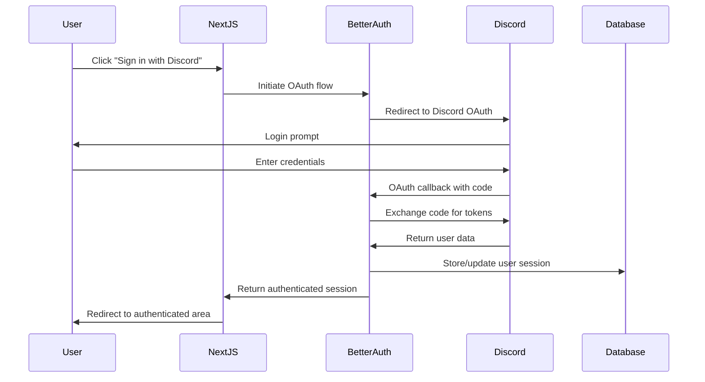
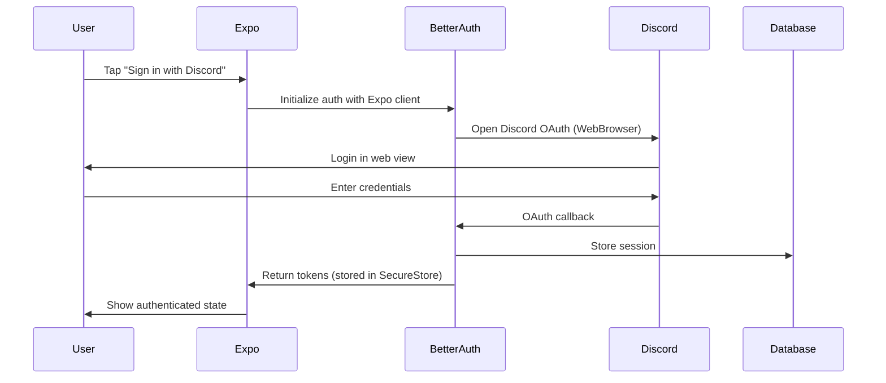

# Fitness App - Technical Reference

## Project Overview

This is a **full-stack fitness application** built on the **create-t3-turbo** stack, featuring a monorepo architecture with web and mobile applications. The project uses TypeScript throughout for end-to-end type safety.

**Current State**: The app is currently a basic blog/post system with authentication. It provides a solid foundation for building fitness-specific features.

## Technology Stack

| Technology | Version | Purpose |
|------------|---------|---------|
| **Next.js** | 15.1.3 | Web application framework |
| **React** | 19.0.0 | UI library |
| **Expo** | SDK 53 | Mobile development platform |
| **React Native** | 0.76.6 | Mobile UI framework |
| **tRPC** | 11.0.12 | Type-safe API layer |
| **Better Auth** | 1.2.2 | Authentication solution |
| **Drizzle ORM** | 0.44.1 | Database ORM |
| **PostgreSQL** | - | Database (via Supabase) |
| **Tailwind CSS** | 3.4.17 | Styling framework |
| **TypeScript** | 5.7.2 | Type safety |
| **Turborepo** | 2.3.3 | Monorepo build system |
| **pnpm** | 10.11.1 | Package manager |

## Project Structure

```
fitness_app/
├── apps/
│   ├── expo/                    # React Native mobile app
│   │   ├── src/
│   │   │   ├── app/            # Expo Router pages
│   │   │   ├── components/     # Mobile-specific components
│   │   │   └── utils/          # Mobile utilities (auth, api)
│   │   ├── app.json           # Expo configuration
│   │   └── package.json
│   └── nextjs/                 # Next.js web application
│       ├── src/
│       │   ├── app/           # App Router pages
│       │   ├── auth/          # Authentication setup
│       │   ├── components/    # Web components
│       │   └── trpc/          # tRPC client setup
│       ├── next.config.js
│       └── package.json
├── packages/
│   ├── api/                   # tRPC API definitions
│   │   ├── src/
│   │   │   ├── router/       # API route handlers
│   │   │   ├── root.ts       # Main tRPC router
│   │   │   └── trpc.ts       # tRPC configuration
│   │   └── package.json
│   ├── auth/                  # Authentication logic
│   │   ├── src/
│   │   │   └── index.ts      # Better Auth configuration
│   │   └── package.json
│   ├── db/                    # Database layer
│   │   ├── src/
│   │   │   ├── schema.ts     # Drizzle schema definitions
│   │   │   ├── client.ts     # Database client
│   │   │   └── index.ts      # Exports
│   │   ├── drizzle.config.ts # Drizzle configuration
│   │   └── package.json
│   ├── ui/                    # Shared UI components
│   │   ├── src/              # shadcn/ui components
│   │   └── package.json
│   └── validators/            # Shared Zod schemas
│       ├── src/
│       └── package.json
├── tooling/                   # Development tooling
│   ├── eslint/               # ESLint configurations
│   ├── prettier/             # Prettier configuration
│   ├── tailwind/             # Tailwind configurations
│   └── typescript/           # TypeScript configurations
├── turbo.json               # Turborepo configuration
├── pnpm-workspace.yaml      # Workspace definition
└── package.json             # Root package.json
```

## Authentication Flow

### Web Application (Next.js)


### Mobile Application (Expo)


## Data Flow Architecture

### API Layer (tRPC)
```
Frontend Request → tRPC Router → Procedure → Database → Response
```

**tRPC Routers:**
- `auth`: Session management (`getSession`)
- `post`: CRUD operations (`all`, `byId`, `create`, `delete`)

**Procedure Types:**
- `publicProcedure`: Open to all users
- `protectedProcedure`: Requires authentication

### Database Access Pattern
```
tRPC Procedure → Drizzle Query Builder → PostgreSQL → Typed Response
```

## Development Setup

### Prerequisites
- Node.js 22.14.0+
- pnpm 10.11.1+

### Installation
```bash
# Clone and install dependencies
pnpm install

# Set up environment variables
cp .env.example .env
# Fill in your Supabase and Discord OAuth credentials
```

### Available Commands

| Command | Description |
|---------|-------------|
| `pnpm dev` | Start all apps in development mode |
| `pnpm build` | Build all packages and apps |
| `pnpm db:push` | Push database schema changes |
| `pnpm db:studio` | Open Drizzle Studio |
| `pnpm db:generate` | Generate database migrations |
| `pnpm lint` | Run ESLint across all packages |
| `pnpm typecheck` | Run TypeScript checks |
| `pnpm clean` | Clean all build artifacts |

### Individual App Commands
```bash
# Web app only
pnpm --filter @acme/nextjs dev

# Mobile app only  
pnpm --filter @acme/expo dev

# Database operations
pnpm --filter @acme/db push
pnpm --filter @acme/db studio
```

## Environment Variables

Create `.env` in the project root:

```env
# Database (Supabase)
POSTGRES_URL="postgres://postgres.[project-ref]:[password]@[region].pooler.supabase.com:6543/postgres?workaround=supabase-pooler.vercel"

# Authentication
AUTH_SECRET="your-secret-key"

# AI/LLM Integration
OPENAI_API_KEY="your-openai-api-key"

# Optional: For OAuth proxy
AUTH_REDIRECT_PROXY_URL="http://localhost:3000"
```

---

## TODO: Authentication System Implementation

### Overview
Implementing a username/password authentication system with business association and role management, replacing the current Discord OAuth setup.

### Requirements
- **Users Table**: Username, password (bcrypt), phone, name, role, businessId
- **Authentication**: Username/password login with Better Auth
- **Sessions**: Persistent sessions (remember me)
- **Roles**: Client and Trainer (no permissions yet)
- **Business**: Single business per user (multi-business structure for future)
- **Security**: Row Level Security by business (future phase)

### Implementation Sequence

#### Phase 1: Database Schema & Migration
1. Create database migrations for:
   - Remove email, emailVerified, image from users table
   - Add phone, username, role, businessId to users table
   - Create user_profile table (skeleton only)
2. Create data migration to preserve exercises and BusinessExercise relationships
3. Run migrations
4. **Test: Verify schema and exercise data intact**

#### Phase 2: Better Auth Configuration
5. Configure Better Auth for username/password
6. Update Better Auth to handle phone number
7. Configure session to include user role and businessId
8. Ensure mobile compatibility
9. **Test: Auth endpoints working**

#### Phase 3: API Layer Updates
10. Update auth router for role management
11. Update all routers to use protectedProcedure
12. Update workout engine endpoints to use auth
13. Update filterExercisesFromInput to get businessId from session
14. **Test: Protected routes and workout engine with auth**

#### Phase 4: Frontend Auth Flow
15. Update login page (username/password)
16. Update signup page (username, phone, role, business)
17. Update auth showcase component
18. **Test: Complete auth flow**

#### Phase 4.5: Role-Based Routing & Navigation
19. Create role-based dashboard routing:
    - Rename `/exercises` to `/trainer-dashboard` (keep existing functionality)
    - Create `/client-dashboard` (placeholder welcome page)
    - Redirect after login based on user role
20. Implement role-based navigation:
    - Trainers see: "Trainer Dashboard" (exercise management)
    - Clients see: "My Workouts" (placeholder for now)
    - Both see: Logout option
21. Add access control:
    - Clients accessing `/trainer-dashboard` → redirect to unauthorized
    - Trainers have full access to all pages
    - Create protected route wrapper component
22. Create `useAuth` hook for checking auth state and user role
23. **Test: Role-based routing and access control**

#### Phase 5: Integration & Cleanup
24. Remove Discord OAuth elements
25. Update environment variables
26. **Test: End-to-end workout creation with auth**
27. **Test: Mobile app authentication**

### Migration Notes
- Exercise data and BusinessExercise relationships must be preserved
- Existing user data can be discarded
- User profile table will be expanded later with workout-specific fields

### Future Considerations
- Multi-business support (user_businesses join table ready)
- SMS authentication
- Row Level Security
- Client profile expansion for workout engine integration