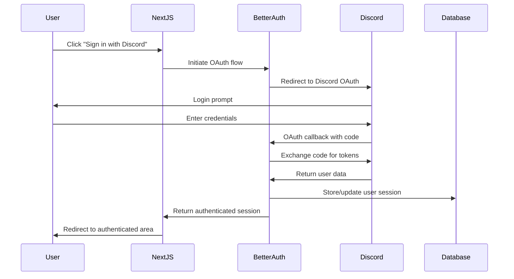
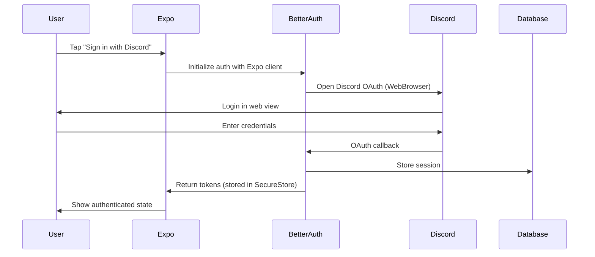

# Fitness App - Technical Reference

## Project Overview

This is a **full-stack fitness application** built on the **create-t3-turbo** stack, featuring a monorepo architecture with web and mobile applications. The project uses TypeScript throughout for end-to-end type safety.

**Current State**: The app is currently a basic blog/post system with authentication. It provides a solid foundation for building fitness-specific features.

## Technology Stack

| Technology | Version | Purpose |
|------------|---------|---------|
| **Next.js** | 15.1.3 | Web application framework |
| **React** | 19.0.0 | UI library |
| **Expo** | SDK 53 | Mobile development platform |
| **React Native** | 0.76.6 | Mobile UI framework |
| **tRPC** | 11.0.12 | Type-safe API layer |
| **Better Auth** | 1.2.2 | Authentication solution |
| **Drizzle ORM** | 0.44.1 | Database ORM |
| **PostgreSQL** | - | Database (via Supabase) |
| **Tailwind CSS** | 3.4.17 | Styling framework |
| **TypeScript** | 5.7.2 | Type safety |
| **Turborepo** | 2.3.3 | Monorepo build system |
| **pnpm** | 10.11.1 | Package manager |

## Project Structure

```
fitness_app/
├── apps/
│   ├── expo/                    # React Native mobile app
│   │   ├── src/
│   │   │   ├── app/            # Expo Router pages
│   │   │   ├── components/     # Mobile-specific components
│   │   │   └── utils/          # Mobile utilities (auth, api)
│   │   ├── app.json           # Expo configuration
│   │   └── package.json
│   └── nextjs/                 # Next.js web application
│       ├── src/
│       │   ├── app/           # App Router pages
│       │   ├── auth/          # Authentication setup
│       │   ├── components/    # Web components
│       │   └── trpc/          # tRPC client setup
│       ├── next.config.js
│       └── package.json
├── packages/
│   ├── api/                   # tRPC API definitions
│   │   ├── src/
│   │   │   ├── router/       # API route handlers
│   │   │   ├── root.ts       # Main tRPC router
│   │   │   └── trpc.ts       # tRPC configuration
│   │   └── package.json
│   ├── auth/                  # Authentication logic
│   │   ├── src/
│   │   │   └── index.ts      # Better Auth configuration
│   │   └── package.json
│   ├── db/                    # Database layer
│   │   ├── src/
│   │   │   ├── schema.ts     # Drizzle schema definitions
│   │   │   ├── client.ts     # Database client
│   │   │   └── index.ts      # Exports
│   │   ├── drizzle.config.ts # Drizzle configuration
│   │   └── package.json
│   ├── ui/                    # Shared UI components
│   │   ├── src/              # shadcn/ui components
│   │   └── package.json
│   └── validators/            # Shared Zod schemas
│       ├── src/
│       └── package.json
├── tooling/                   # Development tooling
│   ├── eslint/               # ESLint configurations
│   ├── prettier/             # Prettier configuration
│   ├── tailwind/             # Tailwind configurations
│   └── typescript/           # TypeScript configurations
├── turbo.json               # Turborepo configuration
├── pnpm-workspace.yaml      # Workspace definition
└── package.json             # Root package.json
```

## Authentication Flow

### Web Application (Next.js)


### Mobile Application (Expo)


## Data Flow Architecture

### API Layer (tRPC)
```
Frontend Request → tRPC Router → Procedure → Database → Response
```

**tRPC Routers:**
- `auth`: Session management (`getSession`)
- `post`: CRUD operations (`all`, `byId`, `create`, `delete`)

**Procedure Types:**
- `publicProcedure`: Open to all users
- `protectedProcedure`: Requires authentication

### Database Access Pattern
```
tRPC Procedure → Drizzle Query Builder → PostgreSQL → Typed Response
```

## Database Schema

### Authentication Tables (Better Auth)
```sql
-- Generated by Better Auth
user (id, name, email, emailVerified, image, createdAt, updatedAt)
session (id, expiresAt, token, createdAt, updatedAt, ipAddress, userAgent, userId)
account (id, accountId, providerId, userId, accessToken, refreshToken, ...)
verification (id, identifier, value, expiresAt, createdAt, updatedAt)
```

### Application Tables
```sql
-- Current app table
post (
  id INTEGER PRIMARY KEY,
  title TEXT NOT NULL,
  content TEXT NOT NULL,
  createdAt TIMESTAMP DEFAULT now(),
  updatedAt TIMESTAMP
)
```

## Current Features

### Web Application (`/apps/nextjs`)
- **Home Page** (`/`):
  - Discord OAuth login/logout
  - View all posts with real-time updates
  - Create new posts (authenticated users)
  - Delete posts (authenticated users)
  - Server-side rendering with data prefetching

### Mobile Application (`/apps/expo`)
- **Home Screen** (`index.tsx`):
  - Discord OAuth authentication
  - Optimized list of posts (using LegendList)
  - Create and delete posts
  - Navigation to individual posts

- **Post Detail Screen** (`post/[id].tsx`):
  - Full post content display
  - Dynamic routing

## Development Setup

### Prerequisites
- Node.js 22.14.0+
- pnpm 10.11.1+

### Installation
```bash
# Clone and install dependencies
pnpm install

# Set up environment variables
cp .env.example .env
# Fill in your Supabase and Discord OAuth credentials
```

### Available Commands

| Command | Description |
|---------|-------------|
| `pnpm dev` | Start all apps in development mode |
| `pnpm build` | Build all packages and apps |
| `pnpm db:push` | Push database schema changes |
| `pnpm db:studio` | Open Drizzle Studio |
| `pnpm db:generate` | Generate database migrations |
| `pnpm lint` | Run ESLint across all packages |
| `pnpm typecheck` | Run TypeScript checks |
| `pnpm clean` | Clean all build artifacts |

### Individual App Commands
```bash
# Web app only
pnpm --filter @acme/nextjs dev

# Mobile app only  
pnpm --filter @acme/expo dev

# Database operations
pnpm --filter @acme/db push
pnpm --filter @acme/db studio
```

## Environment Variables

Create `.env` in the project root:

```env
# Database (Supabase)
POSTGRES_URL="postgres://postgres.[project-ref]:[password]@[region].pooler.supabase.com:6543/postgres?workaround=supabase-pooler.vercel"

# Authentication
AUTH_SECRET="your-secret-key"

# Discord OAuth
AUTH_DISCORD_ID="your-discord-client-id"
AUTH_DISCORD_SECRET="your-discord-client-secret"

# Optional: For OAuth proxy
AUTH_REDIRECT_PROXY_URL="http://localhost:3000"
```


## AI Workout Routine Generator (`/packages/ai`)

### Overview
The AI package provides an intelligent workout routine generation system using LangGraph and OpenAI. It creates personalized workout routines by combining client preferences, routine templates, and exercise data from the database through a multi-node workflow with business-specific exercise filtering.

### Architecture
```
packages/ai/
├── src/
│   ├── graph.ts                    # LangGraph workflow definitions
│   ├── run-workout-generator.ts    # CLI entry point
│   ├── generateWorkoutFromInput.ts # Workout generation API
│   ├── filterExercisesFromInput.ts # Exercise filtering API
│   ├── index.ts                    # Package exports
│   ├── types/                      # TypeScript definitions
│   │   ├── exercise.ts             # Exercise data model
│   │   ├── workoutRoutine.ts       # Workout routine state types
│   │   ├── clientContext.ts        # Client fitness profile
│   │   └── routineTemplate.ts      # Routine template structure
│   ├── nodes/                      # Graph processing nodes
│   │   ├── generateWorkoutNode.ts  # Workout generation logic
│   │   ├── rulesBasedFilterNode.ts # Deterministic exercise filtering
│   │   └── llmPreferenceNode.ts    # AI-based preference scoring
│   └── utils/                      # Utility functions
│       ├── fetchExercises.ts       # Database queries
│       ├── filterExercises.ts      # Exercise filtering logic
│       ├── formatWorkoutPlan.ts    # Output formatting
│       ├── businessValidation.ts   # Business context validation
│       ├── llm.ts                  # OpenAI integration
│       └── graphConfig.ts          # LangGraph configuration
```

### Key Components

#### LangGraph Workflows

**Workout Generation Workflow:**
```
START → rulesBasedFilterNode → llmPreferenceNode → END
```

**Exercise Filtering Workflow:**
```
START → rulesBasedFilterNode → llmPreferenceNode → END
```

#### Type Definitions

**Exercise Model:**
```typescript
interface Exercise {
  id: number
  name: string
  primaryMuscle: string
  secondaryMuscles?: string[]
  loadedJoints?: string[]
  movementPattern: string
  modality: string
  movementTags?: string[]
  functionTags?: string[]
  fatigueProfile: string
  complexityLevel: string
  equipment?: string[]
  strengthLevel: string
  createdAt: Date
  updatedAt?: Date
}
```

**Client Context:**
```typescript
interface ClientContext {
  name: string
  strength_capacity: "very_low" | "low" | "moderate" | "high" | "very_high"
  skill_capacity: "very_low" | "low" | "moderate" | "high"
  primary_goal?: "mobility" | "strength" | "general_fitness" | "hypertrophy" | "burn_fat"
  intensity?: "low_local" | "moderate_local" | "high_local" | "moderate_systemic" | "high_systemic" | "metabolic" | "all"
  muscle_target?: string[]     // Muscles to target more
  muscle_lessen?: string[]     // Muscles to work less
  exercise_requests?: {
    include: string[]          // Must-include exercises
    avoid: string[]           // Must-avoid exercises
  }
  avoid_joints?: string[]      // Joints to avoid (injuries)
  business_id?: string         // Multi-tenant business context
}
```

**Routine Template:**
```typescript
interface RoutineTemplate {
  routine_goal: "hypertrophy" | "mixed_focus" | "conditioning" | "mobility" | "power" | "stability_control"
  muscle_target: string[]      // Template muscle focus
  routine_intensity: "low_local" | "moderate_local" | "high_local" | "moderate_systemic" | "high_systemic" | "metabolic" | "all"
}
```

**Workout Routine State:**
```typescript
type WorkoutRoutineStateType = {
  userInput: string            // User's workout request
  programmedRoutine: string    // Generated routine plan
  exercises: Exercise[]        // All available exercises
  clientContext: ClientContext // Client fitness profile
  filteredExercises: Exercise[] // Filtered exercise results
  routineTemplate: RoutineTemplate // Routine programming template
}
```

### Multi-Tenant Business Architecture

#### Business Context Integration
```typescript
// Business-specific exercise fetching
if (clientContext?.business_id) {
  exercises = await fetchExercisesByBusiness(clientContext.business_id)
} else {
  exercises = await fetchAllExercises() // Graceful fallback
}
```

#### Database Schema
```sql
-- Business entity
business (
  id UUID PRIMARY KEY DEFAULT gen_random_uuid(),
  name VARCHAR(255) NOT NULL,
  created_at TIMESTAMP DEFAULT now(),
  updated_at TIMESTAMP DEFAULT now()
)

-- Junction table for business-exercise relationships
business_exercise (
  id UUID PRIMARY KEY DEFAULT gen_random_uuid(),
  business_id UUID REFERENCES business(id),
  exercise_id INTEGER REFERENCES exercises(id),
  created_at TIMESTAMP DEFAULT now(),
  UNIQUE(business_id, exercise_id)
)
```

### Intelligent Filtering System

#### Rules-Based Filtering (Deterministic)
```typescript
// Priority-based filtering logic:
// 1. Include filters override strength/skill restrictions
// 2. Standard filters (strength/skill) apply to remaining
// 3. Joint avoidance applies to all exercises
// 4. Exclude filters override everything
```

**Filter Categories:**
- **Strength Capacity**: Cascading levels (e.g., "moderate" includes very_low, low, moderate)
- **Skill Capacity**: Progressive complexity filtering
- **Joint Restrictions**: Injury-safe exercise selection
- **Exercise Preferences**: Must-include/must-avoid lists
- **Muscle Targeting**: Client-specific muscle focus

#### LLM-Based Preference Scoring (AI)
```typescript
// Future: OpenAI integration for intelligent exercise scoring
// - Analyzes client goals vs exercise characteristics
// - Considers muscle targeting preferences
// - Applies routine template requirements
// - Provides soft filtering and ranking
```

### API Integration

#### tRPC Exercise Router
```typescript
// Exercise filtering endpoint
filter: publicProcedure
  .input(z.object({
    clientName: z.string().default("Default Client"),
    strengthCapacity: z.enum(["very_low", "low", "moderate", "high", "very_high", "all"]),
    skillCapacity: z.enum(["very_low", "low", "moderate", "high", "all"]),
    includeExercises: z.array(z.string()).default([]),
    avoidExercises: z.array(z.string()).default([]),
    avoidJoints: z.array(z.string()).default([]),
    businessId: z.string().uuid().optional(),
    userInput: z.string().optional(),
  }))
  .query(async ({ input }) => {
    // Processes through LangGraph filtering workflow
  })
```

### Frontend Integration

#### Business Context Management
```typescript
// useBusinessContext hook provides:
// - Dynamic business ID (auth-ready)
// - Environment configuration support
// - Graceful fallbacks
// - Permission system (future)
```

#### Client Configuration Interface
**Phase 1 (Rules-Based):**
- Strength Level, Skill Level
- Include Exercises, Avoid Exercises, Avoid Joints

**Phase 2 (AI-Enhanced):**
- Primary Goal, Muscle Target, Muscle Lessen, Intensity

#### Routine Template Interface
**Phase 2 (Programming):**
- Routine Goal, Muscle Target, Routine Intensity

### Usage Examples

#### CLI Workout Generation
```bash
pnpm -F @acme/ai example

# Output:
# Generated Workout Plan:
# Day 1: Push (Chest, Shoulders, Triceps)
# - Exercise 1: 3 sets of 8-12
# ...
```

#### API Exercise Filtering
```typescript
// Filter exercises with client context
const result = await filterExercisesFromInput({
  clientContext: {
    name: "John Doe",
    strength_capacity: "moderate",
    skill_capacity: "low",
    primary_goal: "hypertrophy",
    muscle_target: ["chest", "shoulders"],
    avoid_joints: ["lower_back"],
    business_id: "business-uuid"
  }
})
```

### OpenAI Integration

#### Configuration
```typescript
// Environment variables required:
OPENAI_API_KEY="your-openai-api-key"

// Supported models:
// - gpt-3.5-turbo (cost-effective)
// - gpt-4o (latest, most capable)
```

#### Error Handling
- API key validation
- Rate limiting awareness
- Graceful fallbacks to rules-based filtering
- Comprehensive error logging

### Current Implementation Status

#### ✅ Completed Features
- Multi-node LangGraph workflow architecture
- Rules-based exercise filtering with priority logic
- Business-specific exercise management
- Client context integration (strength, skill, preferences)
- Routine template structure
- OpenAI integration framework
- Comprehensive type safety throughout
- Business context validation and fallbacks
- Frontend integration with dynamic business context

#### 🚧 In Development
- LLM preference scoring logic
- Advanced routine generation algorithms
- Client-routine template integration workflow

#### 📋 Planned Features
- Exercise progression tracking
- Workout history analysis
- Real-time routine adjustments
- Advanced AI coaching insights
- Performance analytics integration

### Integration Points
- **Database**: Drizzle ORM with business-specific exercise filtering
- **API**: tRPC endpoints for web/mobile exercise filtering
- **Authentication**: Business context ready for auth integration
- **AI**: OpenAI integration for intelligent exercise selection
- **Frontend**: React components with comprehensive client/routine configuration

## Notes and Considerations

### What's Working Well
- ✅ Type-safe API with tRPC
- ✅ Authentication system in place
- ✅ Monorepo structure for code sharing
- ✅ Mobile and web apps working
- ✅ Real-time data synchronization
- ✅ Modern React patterns (Suspense, Server Components)
- ✅ AI workout generation with LangGraph integration


### Development Best Practices
- Use the existing tRPC patterns for new API endpoints
- Follow the established folder structure in packages/
- Leverage shared UI components from @acme/ui
- Add new database tables through Drizzle schema
- Test on both web and mobile during development
- Use LangGraph for complex AI workflows requiring state management
