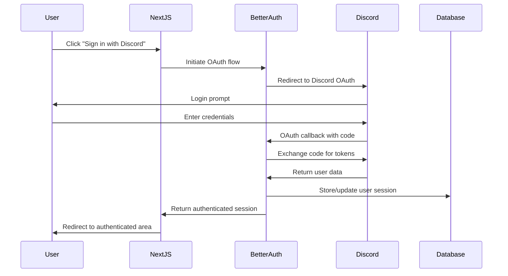
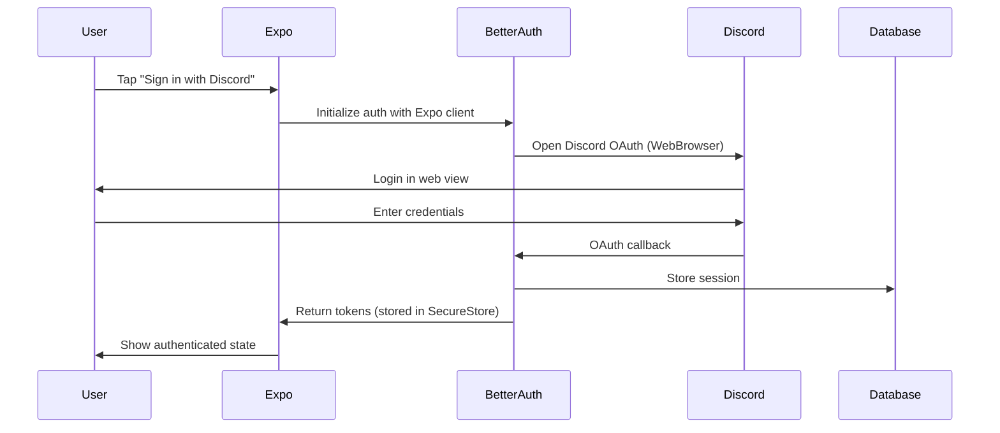

# Fitness App - Technical Reference

## Project Overview

This is a **full-stack fitness application** built on the **create-t3-turbo** stack, featuring a monorepo architecture with web and mobile applications. The project uses TypeScript throughout for end-to-end type safety.

**Current State**: The app is currently a basic blog/post system with authentication. It provides a solid foundation for building fitness-specific features.

## Technology Stack

| Technology | Version | Purpose |
|------------|---------|---------|
| **Next.js** | 15.1.3 | Web application framework |
| **React** | 19.0.0 | UI library |
| **Expo** | SDK 53 | Mobile development platform |
| **React Native** | 0.76.6 | Mobile UI framework |
| **tRPC** | 11.0.12 | Type-safe API layer |
| **Better Auth** | 1.2.2 | Authentication solution |
| **Drizzle ORM** | 0.44.1 | Database ORM |
| **PostgreSQL** | - | Database (via Supabase) |
| **Tailwind CSS** | 3.4.17 | Styling framework |
| **TypeScript** | 5.7.2 | Type safety |
| **Turborepo** | 2.3.3 | Monorepo build system |
| **pnpm** | 10.11.1 | Package manager |

## Project Structure

```
fitness_app/
├── apps/
│   ├── expo/                    # React Native mobile app
│   │   ├── src/
│   │   │   ├── app/            # Expo Router pages
│   │   │   ├── components/     # Mobile-specific components
│   │   │   └── utils/          # Mobile utilities (auth, api)
│   │   ├── app.json           # Expo configuration
│   │   └── package.json
│   └── nextjs/                 # Next.js web application
│       ├── src/
│       │   ├── app/           # App Router pages
│       │   ├── auth/          # Authentication setup
│       │   ├── components/    # Web components
│       │   └── trpc/          # tRPC client setup
│       ├── next.config.js
│       └── package.json
├── packages/
│   ├── api/                   # tRPC API definitions
│   │   ├── src/
│   │   │   ├── router/       # API route handlers
│   │   │   ├── root.ts       # Main tRPC router
│   │   │   └── trpc.ts       # tRPC configuration
│   │   └── package.json
│   ├── auth/                  # Authentication logic
│   │   ├── src/
│   │   │   └── index.ts      # Better Auth configuration
│   │   └── package.json
│   ├── db/                    # Database layer
│   │   ├── src/
│   │   │   ├── schema.ts     # Drizzle schema definitions
│   │   │   ├── client.ts     # Database client
│   │   │   └── index.ts      # Exports
│   │   ├── drizzle.config.ts # Drizzle configuration
│   │   └── package.json
│   ├── ui/                    # Shared UI components
│   │   ├── src/              # shadcn/ui components
│   │   └── package.json
│   └── validators/            # Shared Zod schemas
│       ├── src/
│       └── package.json
├── tooling/                   # Development tooling
│   ├── eslint/               # ESLint configurations
│   ├── prettier/             # Prettier configuration
│   ├── tailwind/             # Tailwind configurations
│   └── typescript/           # TypeScript configurations
├── turbo.json               # Turborepo configuration
├── pnpm-workspace.yaml      # Workspace definition
└── package.json             # Root package.json
```

## Authentication Flow

### Web Application (Next.js)


### Mobile Application (Expo)


## Data Flow Architecture

### API Layer (tRPC)
```
Frontend Request → tRPC Router → Procedure → Database → Response
```

**tRPC Routers:**
- `auth`: Session management (`getSession`)
- `post`: CRUD operations (`all`, `byId`, `create`, `delete`)

**Procedure Types:**
- `publicProcedure`: Open to all users
- `protectedProcedure`: Requires authentication

### Database Access Pattern
```
tRPC Procedure → Drizzle Query Builder → PostgreSQL → Typed Response
```

## Database Schema

### Authentication Tables (Better Auth)
```sql
-- Generated by Better Auth
user (id, name, email, emailVerified, image, createdAt, updatedAt)
session (id, expiresAt, token, createdAt, updatedAt, ipAddress, userAgent, userId)
account (id, accountId, providerId, userId, accessToken, refreshToken, ...)
verification (id, identifier, value, expiresAt, createdAt, updatedAt)
```

### Application Tables
```sql
-- Current app table
post (
  id INTEGER PRIMARY KEY,
  title TEXT NOT NULL,
  content TEXT NOT NULL,
  createdAt TIMESTAMP DEFAULT now(),
  updatedAt TIMESTAMP
)
```

## Current Features

### Web Application (`/apps/nextjs`)
- **Home Page** (`/`):
  - Discord OAuth login/logout
  - View all posts with real-time updates
  - Create new posts (authenticated users)
  - Delete posts (authenticated users)
  - Server-side rendering with data prefetching

### Mobile Application (`/apps/expo`)
- **Home Screen** (`index.tsx`):
  - Discord OAuth authentication
  - Optimized list of posts (using LegendList)
  - Create and delete posts
  - Navigation to individual posts

- **Post Detail Screen** (`post/[id].tsx`):
  - Full post content display
  - Dynamic routing

## Development Setup

### Prerequisites
- Node.js 22.14.0+
- pnpm 10.11.1+

### Installation
```bash
# Clone and install dependencies
pnpm install

# Set up environment variables
cp .env.example .env
# Fill in your Supabase and Discord OAuth credentials
```

### Available Commands

| Command | Description |
|---------|-------------|
| `pnpm dev` | Start all apps in development mode |
| `pnpm build` | Build all packages and apps |
| `pnpm db:push` | Push database schema changes |
| `pnpm db:studio` | Open Drizzle Studio |
| `pnpm db:generate` | Generate database migrations |
| `pnpm lint` | Run ESLint across all packages |
| `pnpm typecheck` | Run TypeScript checks |
| `pnpm clean` | Clean all build artifacts |

### Individual App Commands
```bash
# Web app only
pnpm --filter @acme/nextjs dev

# Mobile app only  
pnpm --filter @acme/expo dev

# Database operations
pnpm --filter @acme/db push
pnpm --filter @acme/db studio
```

## Environment Variables

Create `.env` in the project root:

```env
# Database (Supabase)
POSTGRES_URL="postgres://postgres.[project-ref]:[password]@[region].pooler.supabase.com:6543/postgres?workaround=supabase-pooler.vercel"

# Authentication
AUTH_SECRET="your-secret-key"

# Discord OAuth
AUTH_DISCORD_ID="your-discord-client-id"
AUTH_DISCORD_SECRET="your-discord-client-secret"

# Optional: For OAuth proxy
AUTH_REDIRECT_PROXY_URL="http://localhost:3000"
```


## Notes and Considerations

### What's Working Well
- ✅ Type-safe API with tRPC
- ✅ Authentication system in place
- ✅ Monorepo structure for code sharing
- ✅ Mobile and web apps working
- ✅ Real-time data synchronization
- ✅ Modern React patterns (Suspense, Server Components)


### Development Best Practices
- Use the existing tRPC patterns for new API endpoints
- Follow the established folder structure in packages/
- Leverage shared UI components from @acme/ui
- Add new database tables through Drizzle schema
- Test on both web and mobile during development

## Getting Started with Fitness Features

1. **Plan Database Schema**: Design tables for workouts, exercises, and progress
2. **Create API Endpoints**: Add tRPC routers for fitness functionality
3. **Build UI Components**: Create workout-specific components
4. **Implement Core Features**: Start with workout creation and logging
5. **Add Mobile Features**: Leverage camera and health integrations
6. **Enhance UX**: Add charts, progress visualization, and social features

This reference document should be updated as new features are implemented and the architecture evolves.