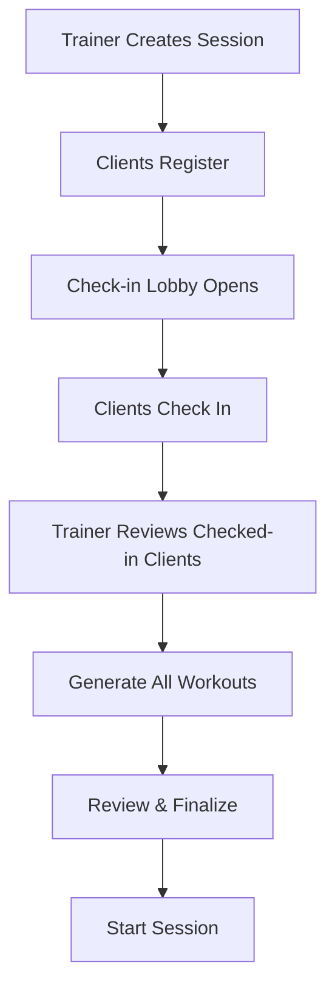
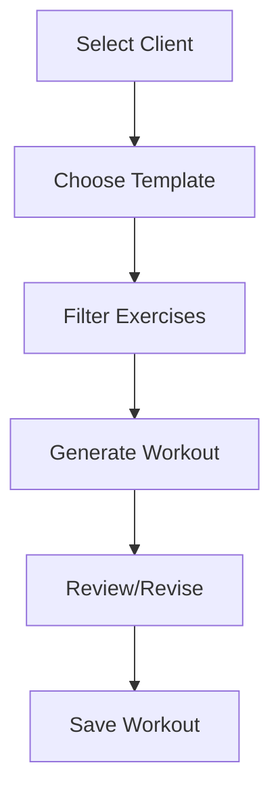

# Workout Generation Architecture - Complete Flow

## Overview
The system supports two primary use cases:
1. **Group Sessions** - Multiple clients, check-in lobby, bulk generation
2. **Individual Workouts** - Direct generation for single client

## Current Implementation Status

### ✅ Completed Backend Components

1. **Database Schema** (`packages/db/schema.ts`)
   - `TrainingSession` - Scheduled group/personal sessions
   - `UserTrainingSession` - Client registrations
   - `Workout` - Stores generated workouts with LLM output
   - `WorkoutExercise` - Individual exercises within workouts

2. **AI Package** (`packages/ai`)
   - Exercise filtering by client capabilities
   - Template-aware workout generation (standard, circuit, full_body)
   - LLM output transformation to database format
   - Complete pipeline from exercise selection to storage

3. **API Endpoints** (`packages/api/router`)
   - `exercise.filter` - Get filtered exercises for client
   - `workout.saveWorkout` - Save LLM-generated workout
   - `trainingSession` router (if exists) - Session management

### 🚧 Not Yet Implemented

1. **Frontend Integration**
   - Workout generation UI
   - Session check-in lobby
   - Workout display/review interface

2. **Check-in System**
   - Status tracking on UserTrainingSession
   - Real-time lobby updates

## Architecture for Both Use Cases

### Use Case 1: Group Session Workflow



**Implementation Path:**

1. **Update Schema** - Add to UserTrainingSession:
```typescript
status: t.text().default('registered'), // 'registered', 'checked_in', 'completed'
checkedInAt: t.timestamp(),
```

2. **Create Check-in Endpoint**:
```typescript
// packages/api/src/router/training-session.ts
checkIn: protectedProcedure
  .input(z.object({
    sessionId: z.string().uuid(),
    userId: z.string().optional(), // If trainer checking in client
  }))
  .mutation(async ({ ctx, input }) => {
    // Update UserTrainingSession status
  })
```

3. **Bulk Generation Endpoint**:
```typescript
generateSessionWorkouts: protectedProcedure
  .input(z.object({
    sessionId: z.string().uuid(),
    templateType: z.enum(['standard', 'circuit', 'full_body']),
  }))
  .mutation(async ({ ctx, input }) => {
    // 1. Get all checked-in users
    // 2. For each user:
    //    - Get their profile
    //    - Filter exercises
    //    - Generate workout via LLM
    //    - Save to database
    // 3. Return all generated workouts
  })
```

### Use Case 2: Individual Workout Workflow



**Implementation Path:**

1. **Update Workout Schema** - Make session optional:
```typescript
trainingSessionId: t.uuid().references(() => TrainingSession.id), // Remove .notNull()
context: t.text().notNull().default('individual'), // 'group', 'individual', 'homework'
```

2. **Direct Generation Endpoint** (already exists!):
```typescript
// This already works for individual workouts!
api.workout.saveWorkout({
  trainingSessionId: null, // or optional
  userId: "client-123",
  llmOutput: generatedWorkout,
  workoutType: "standard"
})
```

## Frontend Components Needed

### 1. Trainer Dashboard Enhancement
```typescript
// apps/nextjs/src/app/trainer-dashboard/page.tsx
- Add "Generate Workout" button after exercise selection
- Add "View Sessions" tab
- Add "Create Session" button
```

### 2. Session Lobby Component
```typescript
// apps/nextjs/src/app/trainer-dashboard/session-lobby.tsx
interface SessionLobbyProps {
  sessionId: string;
  onGenerateWorkouts: () => void;
}

// Shows:
// - Registered clients
// - Check-in status
// - Client fitness levels
// - "Generate All Workouts" button
```

### 3. Workout Generation Modal
```typescript
// apps/nextjs/src/app/trainer-dashboard/workout-generation-modal.tsx
interface WorkoutGenerationProps {
  clientId: string;
  sessionId?: string; // Optional for individual
  exercises: FilteredExercise[];
  onGenerated: (workout: Workout) => void;
}
```

### 4. Workout Review Component
```typescript
// apps/nextjs/src/app/trainer-dashboard/workout-review.tsx
interface WorkoutReviewProps {
  workout: GeneratedWorkout;
  onAccept: () => void;
  onRequestRevision: (feedback: RevisionRequest) => void;
}
```

## API Flow for Both Cases

### Group Session
```typescript
// 1. Create session
const session = await api.trainingSession.create({
  name: "Monday HIIT",
  scheduledAt: new Date(),
  maxParticipants: 12
});

// 2. Clients check in
await api.trainingSession.checkIn({
  sessionId: session.id,
  userId: "client-123"
});

// 3. Generate all workouts
const workouts = await api.workout.generateSessionWorkouts({
  sessionId: session.id,
  templateType: "circuit"
});
```

### Individual Workout
```typescript
// 1. Get filtered exercises
const { exercises } = await api.exercise.filter({
  clientName: "John Doe",
  strengthCapacity: "moderate",
  skillCapacity: "high"
});

// 2. Generate via AI pipeline
const workout = await runWorkoutPipeline({
  exercises,
  clientContext: { /* client details */ },
  templateType: "standard"
});

// 3. Save workout
await api.workout.saveWorkout({
  userId: "client-123",
  llmOutput: workout.llmOutput,
  workoutType: "standard",
  // No trainingSessionId needed!
});
```

## Next Implementation Steps

1. **Schema Updates** ⚡ Priority
   - Add check-in fields to UserTrainingSession
   - Make Workout.trainingSessionId optional
   - Add context field to Workout

2. **API Endpoints** 
   - Check-in endpoint
   - Bulk generation endpoint
   - Get session with check-in status

3. **Frontend - Individual Workflow** ⚡ Start Here
   - Add "Generate Workout" to exercise selection
   - Create workout review modal
   - Save generated workout

4. **Frontend - Group Workflow**
   - Session creation form
   - Check-in lobby
   - Bulk generation UI

## Benefits of This Architecture

1. **Flexibility** - Supports both use cases without forcing unnecessary complexity
2. **Reusability** - Same workout generation pipeline for both flows
3. **Scalability** - Can add more contexts (homework, assessments) easily
4. **Audit Trail** - All workouts tracked regardless of context
5. **Progressive Enhancement** - Can start with individual, add group features later