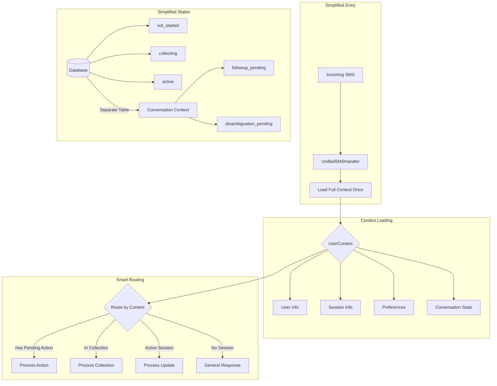

# SMS Flow Refactoring Guide

## 🚨 Current System Analysis

### System Overview
The current SMS system handles check-ins, preference collection, and preference updates through a complex state machine with multiple handlers.

## 📊 Current Flow Diagram

```mermaid
graph TB
    subgraph "Entry Point"
        SMS[Incoming SMS] --> WH[webhook-handler.ts]
    end

    subgraph "Routing Logic"
        WH --> DISC{Is Disambiguation?}
        DISC -->|Numbers Only + Pending| DH[DisambiguationHandler]
        DISC -->|No| PREF{Awaiting Preferences?}
        
        PREF -->|Yes + Active| PUH[PreferenceUpdateHandler]
        PREF -->|Yes + Other| PH[PreferenceHandler]
        PREF -->|No| IR[IntentRouter]
        
        IR -->|check_in| CH[CheckInHandler]
        IR -->|other| DEF[DefaultHandler]
    end

    subgraph "Database States"
        DB[(Database)]
        DB --> |preferenceCollectionStep| STATES
        STATES --> S1[not_started]
        STATES --> S2[initial_collected]
        STATES --> S3[followup_sent]
        STATES --> S4[disambiguation_pending]
        STATES --> S5[disambiguation_resolved]
        STATES --> S6[preferences_active]
    end

    subgraph "Preference Collection Flow"
        PH --> PC1{Current Step?}
        PC1 -->|not_started| PARSE1[Parse with LLM]
        PC1 -->|followup_sent| PARSE2[Parse Followup]
        
        PARSE1 --> NF{needsFollowUp?}
        NF -->|true| FOLLOWUP[Send: "What's your focus?"]
        NF -->|false| COMPLETE1[Complete Preferences]
        
        PARSE2 --> VALIDATE[Validate Exercises]
        VALIDATE --> AMB{Ambiguous?}
        AMB -->|true| DISAMB[Show Exercise List]
        AMB -->|false| COMPLETE2[Activate Preferences]
    end
```

## 🔴 Problems Identified

### 1. State Management Chaos
```typescript
// States are stored in database
UserTrainingSession.preferenceCollectionStep = 
  "not_started" | "initial_collected" | "followup_sent" | 
  "disambiguation_pending" | "disambiguation_resolved" | "preferences_active"

// But logic is scattered across files:
- checkInService.ts: Sets initial state
- preferenceHandler.ts: Manages 5 different state transitions
- workoutPreferenceService.ts: Updates states
- conversationStateService.ts: Tracks disambiguation state separately
```

### 2. Handler Overlap
```
CheckInHandler       → Handles check-in + adds preference prompt
PreferenceHandler    → Handles initial, followup, AND disambiguation
DisambiguationHandler → Only handles number selection
PreferenceUpdateHandler → Handles updates when active
DefaultHandler       → Catch-all
```

### 3. User Context Loss
```typescript
// User info is fetched multiple times:
1. webhook-handler.ts → getUserByPhone()
2. preference-handler.ts → getUserByPhone() 
3. check-in-handler.ts → getUserByPhone() + getUserName()
4. Each handler re-queries the same data!
```

### 4. The "Let's do squats" Bug
When user says "Let's do squats" during followup:
1. ✅ LLM parses: includeExercises: ["squats"]
2. ✅ Validation finds 10 squat variations
3. ✅ System detects disambiguation needed
4. ❌ BUT returns "Great, thank you!" instead of showing options
5. Why? The state flow continues to `determineNextStep()` even after disambiguation

## 🚀 Proposed Refactoring

### New Architecture Overview


### New Data Model

```typescript
// Simplified preference states
enum PreferenceState {
  NOT_STARTED = "not_started",
  COLLECTING = "collecting",    // Replaces 4 intermediate states
  ACTIVE = "active"            // Can receive updates
}

// Separate conversation context (ephemeral)
interface ConversationContext {
  userId: string;
  sessionId: string;
  type: "followup" | "disambiguation" | null;
  data?: {
    // For followup
    fieldsToAsk?: string[];
    
    // For disambiguation
    ambiguousMatches?: ExerciseMatch[];
    originalIntent?: string;
  };
  expiresAt: Date; // Auto-cleanup
}

// Complete user context (loaded once)
interface UserContext {
  user: {
    id: string;
    name: string;
    phone: string;
    businessId: string;
  };
  
  session?: {
    id: string;
    status: "open" | "closed";
    checkedIn: boolean;
    checkInTime?: Date;
  };
  
  preferences?: {
    state: PreferenceState;
    data: ParsedPreferences;
    lastUpdated: Date;
  };
  
  conversation?: ConversationContext;
}
```

### Unified Handler Structure

```typescript
class UnifiedSMSHandler {
  async handle(payload: TwilioSMSPayload): Promise<SMSResponse> {
    // 1. Load everything ONCE
    const context = await this.loadUserContext(payload.From);
    
    // 2. Check for pending actions first
    if (context.conversation?.type === "disambiguation") {
      return this.handleDisambiguation(context, payload.Body);
    }
    
    // 3. Route based on session state
    if (!context.session?.checkedIn) {
      return this.handleCheckIn(context, payload.Body);
    }
    
    if (context.preferences?.state === "collecting") {
      return this.handlePreferenceCollection(context, payload.Body);
    }
    
    if (context.preferences?.state === "active") {
      return this.handlePreferenceUpdate(context, payload.Body);
    }
    
    // 4. Default response
    return this.handleGeneralMessage(context, payload.Body);
  }

  private async handlePreferenceCollection(
    context: UserContext, 
    message: string
  ): Promise<SMSResponse> {
    // Parse preferences
    const parsed = await this.parsePreferences(message, context);
    
    // Check if we need more info
    if (parsed.needsFollowUp && !context.conversation?.type) {
      await this.setFollowupContext(context, parsed);
      return {
        message: this.generateFollowupQuestion(context, parsed)
      };
    }
    
    // Validate exercises
    const validation = await this.validateExercises(parsed, context);
    
    // Check if disambiguation needed
    if (validation.needsDisambiguation) {
      await this.setDisambiguationContext(context, validation);
      return {
        message: this.formatDisambiguationOptions(validation)
      };
    }
    
    // Complete preference collection
    await this.activatePreferences(context, parsed, validation);
    return {
      message: "Great! Your preferences are set. Let's get started! 💪"
    };
  }
}
```

### Key Improvements

1. **Single Context Load**
   ```typescript
   // Before: Multiple DB queries
   const user = await getUserByPhone(phone);
   const session = await getSession(user.id);
   const prefs = await getPreferences(session.id);
   
   // After: One smart query
   const context = await loadUserContext(phone);
   ```

2. **Clear State Transitions**
   ```typescript
   // Before: 6 states with unclear transitions
   // After: 3 states + separate conversation context
   
   NOT_STARTED → COLLECTING → ACTIVE
                    ↓
              [Conversation Context]
              - followup_pending
              - disambiguation_pending
   ```

3. **Personalized Messages**
   ```typescript
   // Always have user name available
   const prompt = `You're checked in, ${context.user.name}! What's your priority?`;
   ```

4. **Fix the Disambiguation Bug**
   ```typescript
   // Check for disambiguation BEFORE other state transitions
   if (validation.needsDisambiguation) {
     // STOP HERE - don't continue to determineNextStep()
     return disambiguationResponse;
   }
   ```

## 📋 Implementation Plan


### Phase 1: Create New Models
1. Add `ConversationContext` table
2. Simplify `preferenceCollectionStep` to 3 states
3. Create `UserContextService` for unified loading

### Phase 2: Build Unified Handler
1. Create `UnifiedSMSHandler` class
2. Implement context-aware routing
3. Consolidate message parsing logic

### Phase 3: Migration
1. Run both systems in parallel
2. Add feature flag for gradual rollout
3. Monitor and compare responses

### Phase 4: Cleanup
1. Remove old handlers
2. Delete redundant state columns
3. Update tests

## 🎯 Success Metrics
- Fewer database queries per message
- Consistent disambiguation behavior
- Cleaner state transitions
- Easier to add new features
- Better test coverage

## 🔄 State Flow Comparison

### Current Flow (Complex)
```
not_started → initial_collected → followup_sent → disambiguation_pending → 
disambiguation_resolved → preferences_active
```

### New Flow (Simple)
```
not_started → collecting → active
              ↓
        [Conversation Context handles temporary states]
```

## 💡 Example: "Let's do squats" Fix

### Current (Broken)
```typescript
// In preference-handler.ts
if (ambiguousMatches.length > 0) {
  return this.handleDisambiguationNeeded(...);
}
// BUG: Code continues to determineNextStep()
```

### New (Fixed)
```typescript
// In unified handler
if (validation.needsDisambiguation) {
  await this.setDisambiguationContext(context, validation);
  return { message: formatOptions(validation) };
  // Clean return - no continuation
}
```

## 🚦 Next Steps
1. Review this guide with the team
2. Create feature branch for refactoring
3. Implement Phase 1 (new models)
4. Build proof-of-concept unified handler
5. Test with real scenarios

This refactoring will make the system more maintainable, testable, and easier to extend with new features.