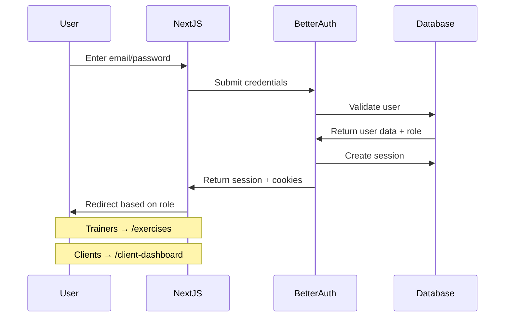
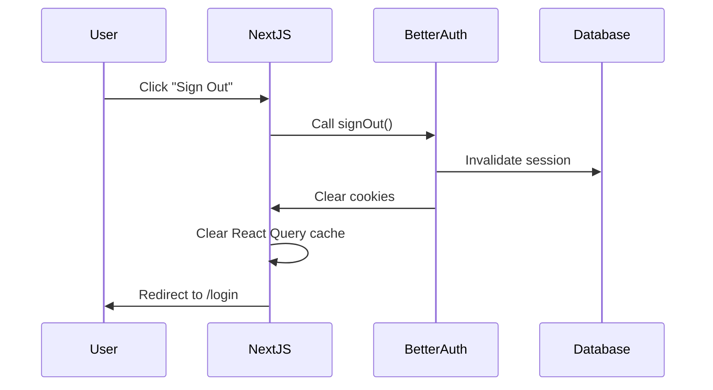
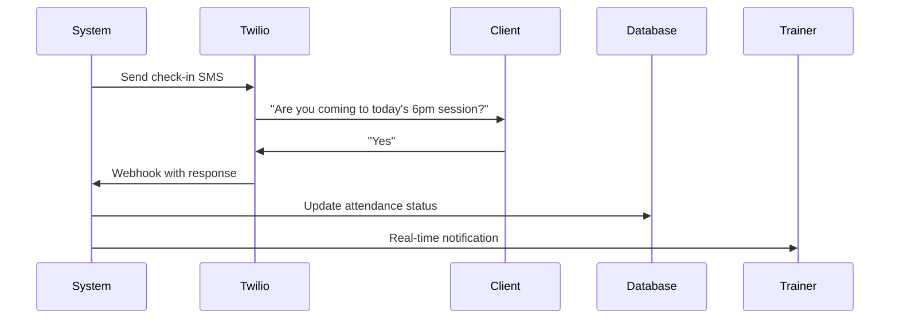

# Fitness App - Technical Reference

## Project Overview

This is a **full-stack fitness application** built on the **create-t3-turbo** stack, featuring a monorepo architecture with web, mobile, and TV applications. The project uses TypeScript throughout for end-to-end type safety.

**Current State**: The app is a production-ready fitness platform featuring:
- AI-powered personalized workout generation for group training sessions
- SMS-based client check-in and communication
- Real-time TV display for gym workouts
- Comprehensive exercise library and workout tracking
- Multi-tenant business support with role-based access

## Technology Stack

| Technology | Version | Purpose |
|------------|---------|---------|
| **Core Frameworks** | | |
| **Next.js** | 15.3.3 | Web application framework |
| **React** | 19.0.0 | UI library for web and mobile |
| **React Native** | 0.79.2 | Mobile framework (standard) |
| **React Native TV** | 0.79.2-0 | TV application framework (tvOS fork) |
| **Expo** | 53.0.9 | Mobile development platform |
| **TypeScript** | 5.8.3 | Type safety across all packages |
| **Build & Package Management** | | |
| **Turborepo** | 2.5.4 | Monorepo build orchestration |
| **pnpm** | 10.11.1 | Package manager with workspace support |
| **Node.js** | ≥22.14.0 | Runtime environment |
| **API & Backend** | | |
| **tRPC** | 11.4.0 | Type-safe API layer |
| **Better Auth** | 1.2.9 | Authentication solution |
| **Drizzle ORM** | 0.44.1 | Database ORM with type safety |
| **PostgreSQL** | - | Database (via Supabase) |
| **Supabase** | 2.53.0 | Database hosting & realtime |
| **Redis (ioredis)** | 5.6.1 | Caching and session management |
| **AI & ML Services** | | |
| **OpenAI** | 5.10.1 | AI workout generation |
| **LangChain** | 0.3.26 | AI orchestration framework |
| **LangGraph** | 0.3.6 | AI workflow management |
| **Tiktoken** | 1.0.21 | Token counting for AI models |
| **Communication** | | |
| **Twilio** | 5.7.3 | SMS notifications and check-ins |
| **UI & Styling** | | |
| **Tailwind CSS** | 3.4.15 | Utility-first CSS framework |
| **NativeWind** | 4.1.23 (mobile) / 2.0.11 (TV) | Tailwind for React Native |
| **Radix UI** | 1.4.2 | Headless UI components |
| **React Hook Form** | 7.57.0 | Form management |
| **Sonner** | 2.0.5 | Toast notifications |
| **State Management** | | |
| **TanStack Query** | 5.80.7 | Server state management |
| **Zod** | 3.25.49 | Schema validation |
| **Testing** | | |
| **Vitest** | 3.2.4 | Unit and integration testing |
| **Playwright** | 1.54.1 | E2E testing for web |
| **React Testing Library** | 16.1.0 | Component testing |
| **Development Tools** | | |
| **ESLint** | 9.28.0 | Code linting |
| **Prettier** | 3.5.3 | Code formatting |
| **dotenv** | 16.4.7 | Environment management |

## Project Structure

```
fitness_app/
├── apps/
│   ├── expo/                    # React Native mobile app
│   │   ├── src/
│   │   │   ├── app/            # Expo Router pages
│   │   │   ├── components/     # Mobile-specific components
│   │   │   └── utils/          # Mobile utilities (auth, api)
│   │   ├── app.json           # Expo configuration
│   │   └── package.json
│   ├── nextjs/                 # Next.js web application
│   │   ├── src/
│   │   │   ├── app/           # App Router pages
│   │   │   ├── auth/          # Authentication setup
│   │   │   ├── components/    # Web components
│   │   │   └── trpc/          # tRPC client setup
│   │   ├── next.config.js
│   │   └── package.json
│   └── tv/                     # React Native TV application
│       ├── src/
│       │   ├── screens/       # TV app screens
│       │   ├── components/    # TV-optimized components
│       │   ├── lib/           # Utilities (lighting, auth)
│       │   └── navigation/    # TV navigation setup
│       ├── android/           # Android TV build config
│       └── package.json
├── packages/
│   ├── api/                   # tRPC API definitions
│   │   ├── src/
│   │   │   ├── router/       # API route handlers
│   │   │   ├── services/     # Business logic services
│   │   │   ├── utils/        # API utilities and helpers
│   │   │   ├── root.ts       # Main tRPC router
│   │   │   └── trpc.ts       # tRPC configuration
│   │   └── package.json
│   ├── ai/                    # AI workout generation
│   │   ├── src/
│   │   │   ├── workout-generation/  # LangGraph AI workflows
│   │   │   ├── agents/       # AI agent implementations
│   │   │   ├── prompts/      # LLM prompt templates
│   │   │   └── client.ts     # OpenAI client setup
│   │   └── package.json
│   ├── auth/                  # Authentication logic
│   │   ├── src/
│   │   │   └── index.ts      # Better Auth configuration
│   │   └── package.json
│   ├── db/                    # Database layer
│   │   ├── src/
│   │   │   ├── schema.ts     # Drizzle schema definitions
│   │   │   ├── client.ts     # Database client
│   │   │   └── index.ts      # Exports
│   │   ├── drizzle.config.ts # Drizzle configuration
│   │   └── package.json
│   ├── ui-shared/             # Platform-agnostic components
│   │   ├── src/
│   │   │   ├── components/   # Base components (Button, Avatar, Card)
│   │   │   ├── context/      # State management (AppContext)
│   │   │   ├── utils/        # Utilities including responsive hooks
│   │   │   └── types/        # Shared TypeScript interfaces
│   │   └── package.json
│   ├── ui-desktop/            # Desktop-specific components
│   │   ├── src/
│   │   │   ├── layouts/      # Desktop layouts (SidebarLayout, GridLayout)
│   │   │   └── components/   # Desktop components
│   │   └── package.json
│   ├── ui-mobile/             # Mobile components (web + native)
│   │   ├── src/
│   │   │   └── components/   # React Native components with NativeWind
│   │   └── package.json
│   └── validators/            # Shared Zod schemas
│       ├── src/
│       └── package.json
├── tooling/                   # Development tooling
│   ├── eslint/               # ESLint configurations
│   ├── prettier/             # Prettier configuration
│   ├── tailwind/             # Tailwind configurations
│   └── typescript/           # TypeScript configurations
├── turbo.json               # Turborepo configuration
├── pnpm-workspace.yaml      # Workspace definition
└── package.json             # Root package.json
```

## Frontend Architecture

### Overview
The frontend architecture follows a modular, platform-adaptive approach that supports desktop web, mobile web, and native mobile experiences from a unified codebase. The architecture emphasizes component reusability, type safety, and progressive enhancement.

### Core Principles

1. **Platform Separation with Shared Logic**
   - Clear boundaries between platform-specific and shared components
   - Maximize code reuse while respecting platform conventions
   - Single source of truth for business logic

2. **Component-First Architecture**
   - Self-contained components with clear responsibilities
   - Composition over inheritance
   - Props-driven interfaces for flexibility

3. **Type Safety Throughout**
   - End-to-end TypeScript from database to UI
   - Shared type definitions across packages
   - Compile-time validation of component contracts

4. **Progressive Enhancement**
   - Desktop-first with mobile optimization
   - Feature detection over browser/device detection
   - Graceful degradation for unsupported features

### Package Architecture

#### ui-shared
Platform-agnostic components and utilities that form the foundation:
- **Base Components**: Button, Avatar, Card, Input, Form elements
- **Business Components**: ExerciseItem, WorkoutCard (base implementations)
- **State Management**: AppContext with hooks for clients, workouts, UI state
- **Utilities**: Responsive hooks, feature flags, common helpers
- **Types**: Shared TypeScript interfaces for data models

#### ui-desktop
Desktop-optimized components leveraging full screen real estate:
- **Layouts**: SidebarLayout, GridLayout for complex layouts
- **Components**: ClientSidebar, WorkoutProgramCard, complex data tables
- **Interactions**: Hover states, keyboard navigation, drag-and-drop
- **Styling**: Standard HTML elements with Tailwind CSS

#### ui-mobile
Cross-platform mobile components using React Native Web:
- **Native Components**: Using React Native primitives (View, Text, Pressable)
- **Web Compatibility**: React Native Web for browser rendering
- **Touch Optimized**: Larger tap targets, swipe gestures, haptic feedback
- **Styling**: NativeWind for Tailwind CSS in React Native

### Responsive System

#### Device Detection Utilities
```typescript
// Comprehensive device and viewport detection
useMediaQuery()    // CSS media query matching
useDeviceType()    // Desktop/tablet/mobile detection
usePlatform()      // Web/iOS/Android detection
useResponsive()    // Combined responsive state
```

#### Conditional Rendering
```typescript
// ResponsiveView component for viewport-based rendering
<ResponsiveView
  desktop={<DesktopWorkoutCard />}
  tablet={<TabletWorkoutCard />}
  mobile={<MobileWorkoutCard />}
/>
```

#### Feature Flags System
- Runtime feature toggling without deployments
- Component-level feature props for granular control
- Environment-based flag configuration
- A/B testing capability

### State Management

#### Context-Based Architecture
Central AppContext provides:
- **Client Management**: Active clients, selection, filtering
- **Workout Data**: Programs, exercises, progress tracking
- **UI State**: Sidebar visibility, loading states, user preferences
- **Optimistic Updates**: Immediate UI feedback with background sync

#### State Hooks
```typescript
useClients()   // Client CRUD operations
useWorkouts()  // Workout management
useUI()        // UI state and preferences
```

### Component Patterns

#### Composition Strategy
```typescript
// Base component in ui-shared
<ExerciseItem exercise={...} />

// Desktop wrapper in ui-desktop
<ExerciseRow>
  <ExerciseItem {...props} />
  <DesktopActions />
</ExerciseRow>

// Mobile wrapper in ui-mobile
<ExerciseListItem>
  <ExerciseItem {...props} />
  <MobileActions />
</ExerciseListItem>
```

#### Feature Props Pattern
All major components accept feature flags for conditional functionality:
```typescript
<WorkoutProgramCard
  showNotifications={isDesktop}
  showFilters={hasPermission}
  compactMode={isMobile}
/>
```

### Styling Architecture

#### Desktop (ui-desktop)
- Standard HTML elements with Tailwind utility classes
- CSS-in-JS for complex animations
- Hover and focus states for accessibility
- Grid and flexbox layouts

#### Mobile (ui-mobile)
- React Native StyleSheet for performance
- NativeWind for Tailwind compatibility
- Platform-specific styles via Platform.select()
- Consistent with iOS/Android design guidelines

### Build Configuration

#### Next.js Integration
```javascript
// Transpile all UI packages
transpilePackages: ["@acme/ui-shared", "@acme/ui-desktop", "@acme/ui-mobile"]

// React Native Web webpack configuration
webpack: (config) => {
  config.resolve.alias = {
    ...config.resolve.alias,
    "react-native$": "react-native-web",
  };
  return config;
}
```

#### TypeScript Configuration
- Shared tsconfig for consistency
- Path aliases for clean imports
- Strict mode enabled
- Composite projects for build optimization

### Development Workflow

1. **Component Development**
   - Start with ui-shared for maximum reuse
   - Extend in platform packages as needed
   - Use Storybook for isolated development

2. **Testing Strategy**
   - Unit tests for business logic
   - Component testing with React Testing Library
   - E2E tests for critical user flows
   - Visual regression testing

3. **Code Organization**
   ```
   ComponentName/
   ├── index.ts              # Exports
   ├── ComponentName.tsx     # Implementation
   ├── ComponentName.types.ts # TypeScript types
   ├── ComponentName.test.tsx # Tests
   └── styles.ts             # Styles (if needed)
   ```

### Performance Optimizations

- **Code Splitting**: Route-based splitting with Next.js
- **Lazy Loading**: Dynamic imports for heavy components
- **Memoization**: React.memo for expensive renders
- **Image Optimization**: Next/Image and lazy loading
- **Bundle Size**: Tree shaking and dead code elimination

### Accessibility

- **ARIA Labels**: Semantic markup with proper roles
- **Keyboard Navigation**: Full keyboard support
- **Screen Readers**: Tested with NVDA/JAWS/VoiceOver
- **Color Contrast**: WCAG AA compliance
- **Focus Management**: Visible focus indicators

### Cross-Platform Shared Logic

#### Overview
The `ui-shared` package contains business logic and utilities that work across web, mobile, and TV applications. This enables consistent behavior and reduces code duplication.

#### Shared Hooks (`packages/ui-shared/src/hooks/`)
- **useClientPreferences**: Manages workout preference operations with optimistic updates
- **useWorkoutActions**: High-level workout mutations with integrated error handling
- **useOptimisticWorkout**: Instant UI updates with rollback on errors
- **useWorkoutBlocks**: Organizes exercises into logical groups
- **useExerciseSelection**: Search, filter, and select exercises
- **useRealtimePreferences**: Supabase realtime subscription for preferences
- **useRealtimeWorkoutExercises**: Live workout exercise updates
- **useRealtimeExerciseSwaps**: Real-time exercise swap notifications

#### Shared Utilities (`packages/ui-shared/src/utils/`)
- **exercise-filters.ts**: Consistent exercise filtering and categorization
  - `filterExercisesBySearch`: Case-insensitive search
  - `categorizeExercisesByRecommendation`: Group by blueprint scores
  - `filterOutActiveExercises`: Remove already selected exercises

#### Usage Pattern
```typescript
// Web (Next.js)
import { useClientPreferences } from '@acme/ui-shared';
import { api } from '~/trpc/react';
import { supabase } from '~/lib/supabase';

const { selections, handleToggleExercise } = useClientPreferences({
  sessionId, userId, trpc: api, supabase
});

// TV App (React Native)
import { useClientPreferences } from '@acme/ui-shared';
import { api } from '../utils/api';
import { supabase } from '../lib/supabase';

// Same hook, different platform-specific imports
```

#### Key Principles
1. **Dependency Injection**: Platform-specific services (tRPC, Supabase) are injected
2. **No UI Components**: Only business logic and data management
3. **"use client" Directive**: Required for hooks using React features
4. **Type Safety**: Shared TypeScript interfaces ensure consistency


## Authentication System (Implemented)

### Features
- **Email/Password Authentication**: Users sign up and log in with email and password
- **User Registration**: Collects email, password, phone number, role (trainer/client), and business association
- **Session Management**: 30-day persistent sessions with secure HTTP-only cookies
- **Role-Based Access**: Different dashboards and permissions for trainers vs clients
- **Protected API Endpoints**: All sensitive routes require authentication via `protectedProcedure`
- **Logout Functionality**: Sign out clears session and redirects to login

### Authentication Flow

#### Web Application (Next.js)


#### Logout Flow


### Database Schema
- **User Table**: `id`, `email`, `password` (hashed), `phone`, `role` (trainer/client), `businessId`
- **UserProfile Table**: `id`, `userId`, `businessId`, `strengthLevel` (very_low/low/moderate/high), `skillLevel` (very_low/low/moderate/high), `notes`
- **Session Table**: `id`, `userId`, `expiresAt`, `token`, `ipAddress`, `userAgent`, `createdAt`, `updatedAt`
- **Business Table**: `id`, `name`, `createdAt`, `updatedAt`

### Protected Routes
- `/exercises` - Trainer dashboard (exercise management)
- `/client-dashboard` - Client dashboard (placeholder for future workouts)
- All API mutations require authentication
- Middleware enforces role-based access control

---

## User Profile System (Implemented)

### Overview
Extended user profiles that capture fitness-specific attributes for personalized workout generation and progress tracking.

### Key Features
- **Fitness Levels**: Track both strength (physical capacity) and skill (technical proficiency) on a 4-point scale
- **Trainer Notes**: Free-form notes field for trainers to document client-specific information
- **Profile Management**: Trainers can create and update client profiles

### Database Schema
```typescript
UserProfile {
  id: string (uuid)
  userId: string (references User)
  strengthLevel: enum ('very_low', 'low', 'moderate', 'high')
  skillLevel: enum ('very_low', 'low', 'moderate', 'high')
  notes: text (nullable)
}
```

### API Endpoints
- `auth.updateClientProfile` - Update strength/skill levels and notes
- `auth.createUserProfile` - Create new profile (auto-creates on user signup)
- `auth.createUserAsTrainer` - Trainers create users with pre-filled profiles

### Integration Points
- Used by AI workout generation to customize exercise selection
- Displayed in trainer dashboard for client overview
- Influences workout difficulty and progression recommendations

## Data Flow Architecture

### API Layer (tRPC)
```
Frontend Request → tRPC Router → Procedure → Database → Response
```

**tRPC Routers:**
- `auth`: Session management (`getSession`, `getSecretMessage`, `getUserRole`, `isTrainer`, `updateUserBusiness`, `updateClientProfile`, `createUserAsTrainer`)
- `exercise`: Exercise management (`all`, `byId`, `search`, `filter`, `create`, `update`, `delete`, `filterForWorkoutGeneration`)
- `business`: Business operations (`all`, `byId`, `create`)
- `trainingSession`: Session scheduling (`create`, `list`, `getById`, `addParticipant`, `removeParticipant`, `myPast`)
- `workout`: Workout management (see Workout Tracking System section for full list)
- `lighting`: Smart lighting control for TV app integration
- `muscleCoverage`: Muscle group analysis for workouts
- `circuitConfig`: Circuit workout configuration management
- `workoutPreferences`: User workout preferences and settings
- `workoutSelections`: Exercise selection tracking for workouts
- `postWorkoutFeedback`: Post-workout feedback collection
- `messages`: SMS messaging via Twilio integration

**Procedure Types:**
- `publicProcedure`: Open to all users
- `protectedProcedure`: Requires authentication

### Database Access Pattern
```
tRPC Procedure → Drizzle Query Builder → PostgreSQL → Typed Response
```

---

## Architectural Patterns

### Soft Delete Pattern (Planned)
The app is designed to support soft deletes for data preservation and audit trails:

- **Planned Implementation**: `deletedAt` timestamp field instead of physical deletion
- **Target Tables**: Workouts (users may want to restore or reference old workouts)
- **Benefits**: 
  - Data recovery possible
  - Historical analytics preserved
  - Audit trail maintained
- **Current Status**: Currently uses hard deletes - soft delete implementation pending
- **Future Pattern**: Queries will filter out soft-deleted records by default

### Business Boundary Enforcement
- All queries automatically filtered by `businessId`
- Cross-business data access prevented at API layer
- Trainers can only see/modify data within their business
- Clients restricted to their own data regardless of business

---

## Backend Service Architecture

### Service Layer Pattern
The API uses a service class pattern to separate business logic from tRPC procedures:

#### Core Services
- **WorkoutService**: Handles workout lifecycle, permissions, and complex operations
- **ExerciseFilterService**: Complex filtering logic for AI-powered exercise selection
- **LLMWorkoutService**: Manages AI-generated workout persistence and validation
- **ExerciseService**: Exercise data access and business-scoped operations

#### Service Features
- Constructor-based dependency injection: `constructor(private db: Database)`
- Consistent error handling with TRPCError
- Transaction support for atomic operations
- Performance monitoring and logging
- Type-safe database operations

#### Error Handling Patterns
Services use standardized error handling:
```typescript
// Example from WorkoutService
static readonly ERROR_MESSAGES = {
  SESSION_NOT_FOUND: 'Training session not found',
  NOT_REGISTERED: 'User is not registered for this session',
  INVALID_CLIENT: 'Invalid client or client not in your business'
};

// Throwing errors with appropriate codes
throw new TRPCError({
  code: 'NOT_FOUND',
  message: WorkoutService.ERROR_MESSAGES.SESSION_NOT_FOUND
});
```

### Utility Layer

#### Logger Utility (`packages/api/src/utils/logger.ts`)
Environment-aware logging system:
```typescript
const logger = createLogger('ContextName');
logger.info('Operation completed');
logger.warn('Slow query detected', { duration: 1500 });
```
- Log levels: debug, info, warn, error
- Controlled by `LOG_LEVEL` environment variable
- Performance monitoring for slow operations
- Context-based logging with timestamps

#### Session Helpers (`packages/api/src/utils/session.ts`)
Authentication and authorization utilities:
- `getSessionUser(ctx)` - Basic authentication check
- `getSessionUserWithBusiness(ctx)` - Ensures business context
- `getTrainerUser(ctx)` - Validates trainer role
- Throws appropriate TRPC errors (UNAUTHORIZED, FORBIDDEN)

#### Query Helpers (`packages/api/src/utils/query-helpers.ts`)
Performance optimizations for database queries:
- `getWorkoutsWithExercisesOptimized` - Prevents N+1 queries
- `withPerformanceMonitoring` - Wraps queries with timing
- Logs slow queries (>1000ms)
- Efficient batch operations

### Middleware

#### Timing Middleware
Tracks procedure execution time:
- Automatically applied to all procedures
- Logs slow operations
- Helps identify performance bottlenecks

#### Request/Response Logging
- Development mode: Detailed request/response logging
- Production mode: Error-only logging
- Configurable via environment variables

## Development Setup

### Prerequisites
- Node.js 22.14.0+
- pnpm 10.11.1+
- PostgreSQL (via Supabase)
- Android Studio (for TV app development)
- Redis (optional, for caching)

### Installation
```bash
# Clone and install dependencies
pnpm install

# Set up environment variables
cp .env.example .env
# Fill in your Supabase and Discord OAuth credentials
```

### Available Commands

| Command | Description |
|---------|-------------|
| `pnpm dev` | Start all apps in development mode |
| `pnpm build` | Build all packages and apps |
| `pnpm db:push` | Push database schema changes |
| `pnpm db:studio` | Open Drizzle Studio |
| `pnpm db:generate` | Generate database migrations |
| `pnpm lint` | Run ESLint across all packages |
| `pnpm typecheck` | Run TypeScript checks |
| `pnpm clean` | Clean all build artifacts |

### Individual App Commands
```bash
# Web app only
pnpm --filter @acme/nextjs dev

# Mobile app only  
pnpm --filter @acme/expo dev

# Database operations
pnpm --filter @acme/db push
pnpm --filter @acme/db studio
```

## Environment Variables

Create `.env` in the project root:

```env
# Database (Supabase)
POSTGRES_URL="postgres://postgres.[project-ref]:[password]@[region].pooler.supabase.com:6543/postgres?workaround=supabase-pooler.vercel"

# Authentication
AUTH_SECRET="your-secret-key"

# AI/LLM Integration
OPENAI_API_KEY="your-openai-api-key"

# SMS Communication (Twilio)
TWILIO_ACCOUNT_SID="your-twilio-account-sid"
TWILIO_AUTH_TOKEN="your-twilio-auth-token"
TWILIO_PHONE_NUMBER="+1234567890"

# Supabase Realtime
SUPABASE_URL="https://[project-ref].supabase.co"
SUPABASE_ANON_KEY="your-supabase-anon-key"

# Smart Lighting (Optional)
LIFX_ACCESS_TOKEN="your-lifx-token"

# Optional: For OAuth proxy
AUTH_REDIRECT_PROXY_URL="http://localhost:3000"

# Logging and Development
LOG_LEVEL="error"  # Options: debug, info, warn, error (default: error)
NODE_ENV="development"  # Used for dev-specific logging and debugging
```

---

## Workout Tracking System (Implemented)

### Overview
A comprehensive workout tracking system that allows clients to view their training history and trainers to manage/log workouts. The system tracks training sessions (scheduled appointments), participant registration, and actual workout data with exercises performed.

### Database Schema (Implemented)

#### Training Session
- Scheduled appointments created by trainers
- Fields: `id`, `business_id`, `trainer_id`, `name`, `scheduled_at`, `duration_minutes`, `max_participants`

#### User Training Session
- Join table for users registered to attend sessions
- Fields: `id`, `user_id`, `training_session_id`, `created_at`
- Unique constraint on (user_id, training_session_id)

#### Workout
- Actual workout data completed during a session
- Fields: `id`, `training_session_id`, `user_id`, `completed_at`, `notes`

#### Workout Exercise
- Exercises performed in a workout
- Fields: `id`, `workout_id`, `exercise_id`, `order_index`, `sets_completed`

### Business Exercise Integration (Implemented)
- Exercises are filtered by business using the `business_exercise` join table
- All exercise endpoints (`all`, `search`, `filter`) respect business boundaries
- Trainers only see exercises available to their business

### API Endpoints

#### Training Session Management (`trainingSession` router)
- **create** - Trainers create new training sessions
- **list** - List all sessions with optional filters (trainer, date range)
- **getById** - Get session details including participants
- **addParticipant** - Register a user for a session
- **removeParticipant** - Unregister a user from a session
- **myPast** - Get user's past training sessions

#### Workout Tracking (`workout` router)
- **create** - Log a workout for a training session with exercises
- **addExercises** - Add exercises to an existing workout
- **myWorkouts** - Get user's workout history with exercise counts
- **getById** - Get detailed workout including all exercises performed
- **clientWorkouts** - Trainers view a specific client's workout history
- **sessionWorkouts** - View all workouts for a specific training session
- **getClientWorkoutsWithExercises** - Get client's latest workouts with full exercise details (trainer dashboard)
- **saveWorkout** - Save AI-generated workout to database
- **generateIndividual** - Generate individual workout without training session
- **deleteExercise** - Remove exercise from workout with reordering
- **updateExerciseOrder** - Reorder exercises within same block
- **deleteBlock** - Remove entire exercise block
- **deleteWorkout** - Delete entire workout
- **replaceExercise** - Swap one exercise for another
- **addExercise** - Add new exercise to existing workout
- **duplicateWorkout** - Copy workout for same or different client

### Access Control

#### Client Permissions
- View only their own workouts and training history
- Register/unregister themselves from training sessions
- Cannot see other users' workout data

#### Trainer Permissions
- Create and manage training sessions
- View all workouts within their business
- Log workouts for any client in their business
- Add/remove participants from sessions

### Security Features
- All data is filtered by `businessId` to prevent cross-business access
- Role-based permissions enforced at the API level
- Validation ensures users can only access appropriate data
- Transactions used for multi-table operations

### Usage Example Flow
1. Trainer creates a training session for "Monday Morning HIIT"
2. Clients register for the session via `addParticipant`
3. After the session, trainer logs each client's workout
4. Trainer adds exercises performed with sets completed
5. Clients can view their workout history via `myWorkouts`
6. Trainers can analyze all workouts for the session

### Future Enhancements
- Add reps, weight, rest time tracking per set
- Workout templates and programs
- Progress tracking and analytics
- Integration with AI workout generator for session planning
- Mobile app integration for real-time workout logging

---

## AI Workout Generation System (Implemented)

### Overview
A sophisticated AI-powered workout generation system using LangChain and LangGraph that creates personalized workouts based on client profiles, available equipment, and training goals. The system employs a multi-agent architecture for intelligent exercise selection and workout structuring.

### Architecture
The AI system uses a graph-based workflow with specialized agents:

#### Agent Hierarchy
1. **Orchestrator Agent**: Manages the overall workflow and coordinates between agents
2. **Muscle Coverage Agent**: Ensures balanced muscle group distribution
3. **Exercise Selection Agent**: Picks appropriate exercises based on constraints
4. **Workout Structure Agent**: Organizes exercises into logical blocks/circuits
5. **Set/Rep Agent**: Determines appropriate volume for each exercise

#### LangGraph Workflow
```typescript
// Simplified workflow representation
const workoutGraph = new StateGraph()
  .addNode("analyze_requirements", analyzeRequirements)
  .addNode("select_exercises", selectExercises)
  .addNode("structure_workout", structureWorkout)
  .addNode("assign_sets_reps", assignSetsReps)
  .addNode("validate_output", validateOutput)
  .addConditionalEdges(/* routing logic */);
```

### Features
- **Multi-template Support**: Standard, Circuit, Full Body, and EMOM workouts
- **Equipment-aware**: Filters exercises based on available gym equipment
- **Skill/Strength Matching**: Adapts difficulty to client capabilities
- **Progressive Overload**: Considers workout history for progression
- **Constraint Satisfaction**: Respects time limits, equipment, and space constraints

### Core Features

#### One-Click Workout Generation
- Trainers can generate complete workouts for clients with a single action
- AI analyzes client profile (strength, skill, goals) and creates appropriate workouts
- Immediate storage to database upon generation

#### Template-Based Workout Types
- **Standard**: Traditional strength training with blocks (A, B, C, D)
- **Circuit**: Time-based rounds with work/rest intervals
- **Full Body**: Balanced workouts with muscle group requirements

#### Intelligent Exercise Matching
- AI-generated exercise names are automatically matched to database exercises
- Fuzzy matching handles variations in exercise naming
- Invalid or unrecognized exercises are flagged with warnings but don't break the flow

#### Client-Workout Association
- Every workout is directly linked to a specific client via `user_id`
- Enables comprehensive workout history tracking
- Foundation for future progress analytics and reporting

### Technical Architecture

#### Database Schema
**Workout Table Extensions:**
- `workoutType`: Type of workout (standard/circuit/full_body)
- `totalPlannedSets`: Total sets planned by AI
- `llmOutput`: Complete AI response stored for reference
- `templateConfig`: Template-specific configuration

**WorkoutExercise Table Extensions:**
- `groupName`: Flexible grouping ("Block A", "Round 1", etc.)

#### Workflow Pipeline
1. **Exercise Selection**: Filter and score exercises based on client profile
2. **AI Generation**: LLM creates structured workout with sets/reps
3. **Validation**: Exercise names validated against database
4. **Transformation**: AI output converted to database format
5. **Storage**: Atomic transaction saves workout and exercises

### API Integration

**generateIndividual Endpoint**
- Creates workouts directly for clients without requiring a training session
- Enforces business boundaries - trainers can only generate workouts for clients in their business
- Accepts template type (standard/circuit/full_body) and AI-generated exercise structure
- Marks workouts with context "individual" to distinguish from group session workouts
- Currently allows both trainers and clients to generate workouts (no role restriction)

**saveWorkout Endpoint**
- Accepts AI-generated workout output for training sessions
- Validates training session and client permissions
- Automatically handles exercise lookups
- Returns saved workout with all associations
- Marks workouts with context "group" for session-based workouts

---

## Workout Management System (Implemented)

### Overview
A complete workout management system that enables users to manipulate workouts after generation. The system provides full CRUD operations on exercises within workouts, block management, and workout duplication capabilities with optimistic UI updates for excellent user experience.

### Core Features

#### Exercise Operations
- **Delete Exercise**: Remove individual exercises with automatic reordering of remaining exercises in the same block
- **Reorder Exercise**: Move exercises up/down within their block boundaries
- **Replace Exercise**: Swap one exercise for another while maintaining position and sets
- **Add Exercise**: Insert new exercises at the beginning or end of any block

#### Block Management
- **Delete Block**: Remove entire exercise groups (e.g., "Block A", "Block B")
- **Block Integrity**: Exercises cannot be moved across block boundaries
- **Automatic Reordering**: Order indices automatically adjust when exercises are added/removed

#### Workout Operations
- **Delete Workout**: Soft delete with cascade handling
- **Duplicate Workout**: Copy entire workouts for same user or different clients
- **Business Boundaries**: All operations respect business ownership rules

### Technical Implementation

#### API Layer (tRPC Mutations)

**Basic Exercise Operations**
```typescript
// packages/api/src/router/workout.ts

deleteExercise: protectedProcedure
  .input(z.object({
    workoutId: z.string().uuid(),
    workoutExerciseId: z.string().uuid()
  }))
  .mutation(async ({ ctx, input }) => {
    // Transaction-based deletion
    // Automatic reordering of remaining exercises
    // Maintains block structure
  })

updateExerciseOrder: protectedProcedure
  .input(z.object({
    workoutId: z.string().uuid(),
    workoutExerciseId: z.string().uuid(),
    direction: z.enum(['up', 'down'])
  }))
  .mutation(async ({ ctx, input }) => {
    // Swaps orderIndex with adjacent exercise
    // Validates block boundaries
    // Returns updated exercise pair
  })
```

**Advanced Operations**
```typescript
replaceExercise: protectedProcedure
  .input(z.object({
    workoutId: z.string().uuid(),
    workoutExerciseId: z.string().uuid(),
    newExerciseId: z.string().uuid()
  }))
  .mutation(async ({ ctx, input }) => {
    // Updates exerciseId while preserving all other properties
    // Validates new exercise exists in business
  })

addExercise: protectedProcedure
  .input(z.object({
    workoutId: z.string().uuid(),
    exerciseId: z.string().uuid(),
    groupName: z.string(),
    position: z.enum(['beginning', 'end']).default('end'),
    sets: z.number().min(1).default(3)
  }))
  .mutation(async ({ ctx, input }) => {
    // Calculates appropriate orderIndex
    // Shifts existing exercises if needed
    // Respects block organization
  })

duplicateWorkout: protectedProcedure
  .input(z.object({
    workoutId: z.string().uuid(),
    targetUserId: z.string().uuid().optional(),
    notes: z.string().optional()
  }))
  .mutation(async ({ ctx, input }) => {
    // Creates exact copy with new IDs
    // Preserves all exercises and their order
    // Copies llmOutput and templateConfig metadata
    // Supports trainer-to-client duplication
  })
```

#### Shared UI Hooks (Platform-Agnostic)

**useWorkoutMutations**
- Low-level wrapper around all tRPC mutations
- No optimistic updates at this level
- Direct access to mutation states and loading indicators

**useOptimisticWorkout**
- Manages instant UI updates before server confirmation
- Provides rollback capability on errors
- Caches previous state for recovery

**useWorkoutActions**
- High-level hook combining mutations with optimistic updates
- Integrated toast notifications for user feedback
- Success/error callbacks for navigation
- Action state tracking for individual operations

**useWorkoutBlocks**
- Organizes exercises into logical blocks
- Provides block-level statistics (total sets, exercise count)
- Calculates available block names for new exercises
- Validates reorder operations within block constraints

**useExerciseSelection**
- Search and filter exercises by name, muscle, equipment
- Group exercises by various criteria
- Find similar exercises based on muscle/movement pattern
- Selection state management with callbacks

### Optimistic Update Architecture

#### Update Flow
1. User initiates action (delete, reorder, etc.)
2. UI immediately updates with expected result
3. API mutation runs in background
4. Success: UI state confirmed
5. Error: Automatic rollback to previous state with error toast

#### Implementation Example
```typescript
const handleDeleteExercise = async (exerciseId: string) => {
  // 1. Optimistic update
  optimistic.optimisticDeleteExercise(exerciseId);
  
  // 2. API call
  try {
    await mutation.mutateAsync({ workoutId, exerciseId });
    toast.show('Exercise deleted', 'success');
  } catch (error) {
    // 3. Rollback on error
    optimistic.rollback();
    toast.show('Failed to delete', 'error');
  }
};
```

### Test Coverage

#### API Tests (packages/api/test/)
- All 7 mutations fully tested
- Error scenarios and edge cases covered
- Transaction rollback verification
- Authorization and business boundary checks

#### UI Hook Tests (packages/ui-shared/test/hooks/)
- 75 tests across all 5 hooks
- Optimistic update behavior verification
- Rollback scenarios tested
- State management validation

### Security & Data Integrity

#### Business Boundaries
- All operations verify workout ownership
- Trainers can only modify workouts in their business
- Clients restricted to their own workouts

#### Transaction Safety
- Multi-row operations use database transactions
- Automatic rollback on any failure
- Consistent state guaranteed

#### Order Management
- Automatic reordering maintains continuous indices
- Block boundaries strictly enforced
- No gaps in exercise ordering

### Integration with Existing Systems

#### Works With AI Generation
- Modifies AI-generated workouts seamlessly
- Preserves llmOutput and templateConfig
- Maintains workout structure integrity

#### Exercise Database Integration
- Validates exercises exist before operations
- Respects business-exercise relationships
- Maintains referential integrity

### Usage Examples

#### Component Integration
```typescript
const WorkoutEditor = ({ workout }) => {
  const actions = useWorkoutActions({
    workoutId: workout.id,
    api: trpc,
    toast: useToast(),
    onDeleteWorkoutSuccess: () => router.push('/workouts'),
    onDuplicateSuccess: (newId) => router.push(`/workout/${newId}`)
  });

  return (
    <div>
      {workout.exercises.map(exercise => (
        <ExerciseRow
          key={exercise.id}
          exercise={exercise}
          onDelete={() => actions.deleteExercise(exercise.id, exercise.name)}
          onMoveUp={() => actions.reorderExercise(exercise.id, 'up')}
          onMoveDown={() => actions.reorderExercise(exercise.id, 'down')}
          canMoveUp={actions.canReorderExercise(exercise.id, 'up')}
          canMoveDown={actions.canReorderExercise(exercise.id, 'down')}
        />
      ))}
    </div>
  );
};
```

### Performance Optimizations

#### Batch Operations
- Block deletion removes all exercises in single transaction
- Reordering updates only affected exercises
- Minimal database queries

#### Optimistic UI
- Instant feedback without waiting for server
- Background synchronization
- Automatic conflict resolution

### Future Enhancements
- Bulk exercise operations (select multiple)
- Undo/redo functionality
- Workout versioning and history
- Template creation from existing workouts
- Collaborative editing with conflict resolution

---

## Realtime Features (Implemented)

### Overview
Extensive use of Supabase Realtime for live updates across web and TV applications, enabling synchronized multi-device experiences during training sessions.

### Key Realtime Features

#### Live Workout Updates
- **Exercise Swaps**: Trainers can swap exercises in real-time, updates reflect instantly on TV
- **Progress Tracking**: As clients complete sets, progress updates across all devices
- **Circuit Timing**: Synchronized timers for circuit training across all screens

#### Session Management
- **Check-in Status**: Real-time client attendance updates
- **Participant List**: Live updates as clients join/leave sessions
- **Session State**: Start/pause/stop controls sync across devices

#### Preference Syncing
- **Client Preferences**: Equipment availability, exercise restrictions update live
- **Global Settings**: Session-wide preferences (music, lighting) sync instantly
- **Workout Modifications**: Real-time adjustments based on client feedback

### Technical Implementation
```typescript
// Example: Realtime workout updates
const channel = supabase
  .channel(`workout-${workoutId}`)
  .on('postgres_changes', {
    event: '*',
    schema: 'public',
    table: 'workout_exercise',
    filter: `workout_id=eq.${workoutId}`
  }, handleExerciseUpdate)
  .subscribe();
```

### Realtime Hooks
- `useRealtimeWorkoutExercises`: Live exercise updates
- `useRealtimeCheckIns`: Client attendance tracking
- `useRealtimeCircuitConfig`: Circuit timing synchronization
- `useRealtimePreferences`: Preference updates
- `useRealtimeExerciseSwaps`: Exercise substitution tracking

---

## SMS Communication System (Implemented)

### Overview
Integrated SMS messaging system using Twilio for client check-ins, workout notifications, and two-way communication between trainers and clients.

### Key Features
- **Client Check-ins**: Automated SMS sent to clients before training sessions
- **Response Tracking**: System processes client responses (Yes/No/Maybe)
- **Trainer Notifications**: Real-time updates when clients respond
- **Workout Updates**: SMS notifications for workout assignments and changes
- **Two-way Messaging**: Clients can text questions, trainers receive and respond

### Technical Implementation
- **Twilio Integration**: Full SMS API integration with webhook support
- **Message Queue**: Redis-based queue for reliable message delivery
- **Webhook Handler**: `/api/twilio/webhook` endpoint for incoming messages
- **Rate Limiting**: Prevents SMS spam and manages costs
- **Message History**: Full audit trail of all SMS communications

### Message Flow


### API Endpoints
- `messages.sendCheckIn`: Send check-in SMS to session participants
- `messages.processResponse`: Handle incoming SMS responses
- `messages.sendCustom`: Send custom messages to clients
- `messages.getHistory`: Retrieve message history for a client

---

## TV Application (Implemented)

### Overview
A dedicated React Native TV application designed for gym environments, providing real-time workout display and automated lighting control during training sessions.

### Key Features
- **Real-time Workout Display**: Shows active workouts with exercise details, sets, and reps
- **Circuit Training Support**: Specialized views for time-based circuit workouts
- **Smart Lighting Integration**: Automated lighting scenes synchronized with workout phases
- **Multi-client Support**: Displays workouts for multiple participants in group sessions
- **Focus Mode Navigation**: TV remote-friendly interface with clear focus states

### Technology Stack
- **React Native TV**: Fork of React Native optimized for tvOS and Android TV
- **NativeWind 2.0.11**: Tailwind CSS styling for TV interface
- **React Navigation**: TV-optimized navigation with remote control support
- **Supabase Realtime**: WebSocket connection for live workout updates

### Architecture
```
tv/
├── src/
│   ├── screens/
│   │   ├── MainScreen.tsx          # Landing screen with session selection
│   │   ├── CircuitWorkoutLiveScreen.tsx  # Live circuit workout display
│   │   └── LightingTestScreen.tsx  # Lighting integration testing
│   ├── components/
│   │   ├── ExerciseCard.tsx       # Individual exercise display
│   │   ├── WorkoutTimer.tsx       # Circuit timing display
│   │   └── FocusableButton.tsx    # TV remote-friendly buttons
│   └── lib/
│       ├── lighting/              # LIFX smart lighting control
│       ├── auth/                  # Authentication setup
│       └── api/                   # tRPC client configuration
└── android/
    └── app/
        └── build.gradle           # TV-specific build configuration
```

### Lighting System
- **LIFX Integration**: Direct API integration for smart bulb control
- **Preset Scenes**: Pre-configured lighting for different workout phases
- **Smooth Transitions**: Gradual color/brightness changes between exercises
- **Animation Support**: Pulse and breathe effects for timing cues

### Build & Deployment
```bash
# Development
pnpm run dev:tv          # Start Metro bundler for TV
pnpm run android:tv      # Run on Android TV emulator/device

# Production Build
pnpm run build:tv        # Create production APK
pnpm run deploy:tv       # Install on connected TV device
```

### Remote Control Navigation
- **D-pad Navigation**: Full support for directional navigation
- **Focus Management**: Clear visual indicators for focused elements
- **Spatial Navigation**: Predictable focus movement between elements
- **Back Button**: Proper handling of TV remote back button

---

## Testing Infrastructure (Implemented)

### Overview
Comprehensive test suites ensure reliability across API mutations and UI components.

### API Tests (packages/api/test/)
- **Coverage**: All workout mutations, exercise CRUD, authentication flows
- **Framework**: Vitest with database transactions
- **Key Files**:
  - `workout-mutations.test.ts` - Core workout operations
  - `workout-mutations-phase2.test.ts` - Advanced operations
  - `exercise-crud.test.ts` - Exercise management
- **Features**:
  - Isolated test transactions (auto-rollback)
  - Mock user/business setup
  - Error scenario coverage
  - Authorization testing

### UI Hook Tests (packages/ui-shared/test/hooks/)
- **Coverage**: All 5 workout management hooks
- **Framework**: Vitest + React Testing Library
- **Test Count**: 75 tests total
- **Key Areas**:
  - Optimistic update behavior
  - Error rollback scenarios
  - State management validation
  - Platform-agnostic functionality

### Test Patterns
```typescript
// API test pattern
test('should delete exercise and reorder', async () => {
  await db.transaction(async (tx) => {
    // Setup test data
    // Execute mutation
    // Verify results
    // Transaction auto-rollbacks
  });
});

// Hook test pattern  
test('should optimistically update', () => {
  const { result } = renderHook(() => useWorkoutActions(...));
  // Trigger action
  // Verify immediate UI update
  // Verify API call
  // Test rollback on error
});
```

### Running Tests
- `pnpm test` - Run all tests
- `pnpm test:api` - API tests only  
- `pnpm test:ui` - UI tests only
- Tests run in CI/CD pipeline
